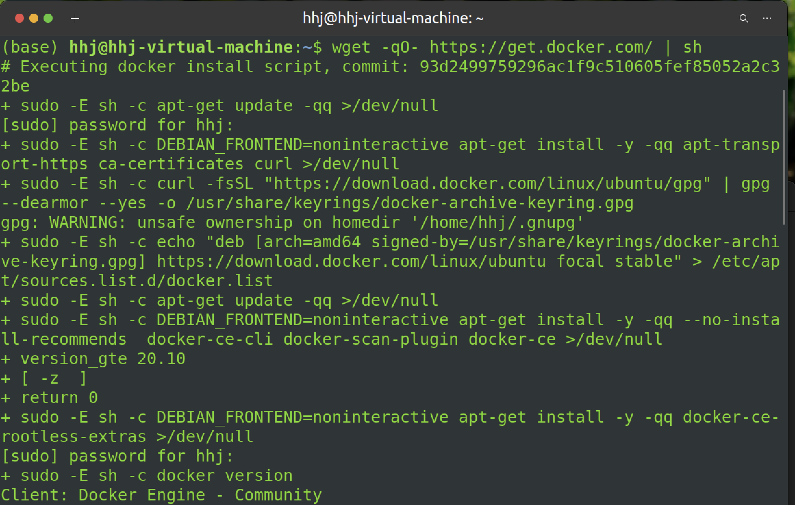
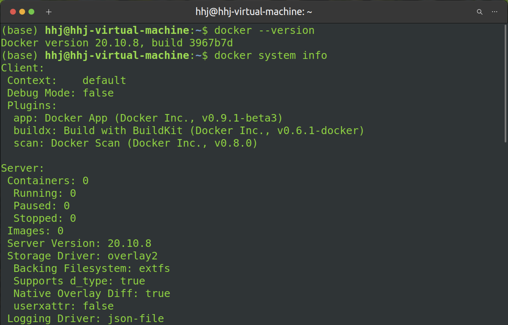

# Docker

Docker 是一个开源的、轻量级的容器引擎，主要运行于 Linux 和 Windows，用于创建、管理和编排容器。

和 VMware 虚拟机相比，Docker 使用容器承载应用程序，而不使用操作系统，所以它的**开销很少，性能很高**。但是，Docker 对应用程序的隔离不如虚拟机彻底，所以它并**不能完全取代** VMware。


## Docker 简介

### Docker 公司的由来

>   “Docker”一词来自英国口语，意为码头工人（Dock Worker），即从船上装卸货物的人。

Docker 公司起初是一家名为 dotCloud 的平台即服务（Platform-as-a-Service, Paas）提供商，其平台利用了 Linux 容器技术。为了方便创建和管理这些容器， dotCloud 开发了一套内部工具 “Docker”。后来由于业务不景气，公司在聘请了新的 CEO Ben Golub 后，将公司改名为 Docker ，放弃了 Paas 平台，专注于 Docker 技术。如今 Docker 公司被普遍认为是一家创新型科技公司，已经过多轮融资。

### Docker 运行时与编排引擎

多数技术人员在谈到 Docker 时，主要是指 Docker 引擎。

运行虚拟机的核心管理程序是 ESXi ，而 Docker 引擎是运行容器的核心容器运行时。


_Docker 引擎位于中心，其他产品基于 Docker 引擎的核心功能进行集成_

Docker 引擎主要有两个版本：企业版（EE）和社区版（CE）。每个季度，企业版和社区版都会发布一个稳定版本。从 2017 年第一季度开始，Docker 版本号遵循 YY.MM-xx 格式，类似于 Ubuntu 等项目。

### Docker 开源项目 —— Moby

开源 Docker 项目在 2017 年于 Austin 举办的 DockerCon 上正式命名为 Moby 项目，并且拥有了项目自己的 Logo，如下图所示。


Moby 项目的目标是基于开源的方式，发展成为 Docker 上游，并将 Docker 拆分为更多的模块化组件。

多数项目及其工具都是基于 Golang 编写的，这是谷歌推出的一种新的系统级编程语言，又叫 Go 语言。使用 Go 语言的读者，将更容易为该项目贡献代码。

### 容器生态

Docker 公司的一个核心哲学通常被称为“含电池，但可拆卸”（Batteries included but removable），意思是许多 Docker 内置的组件都可以替换为第三方的组件。随着 Docker 提供的内置组件越来越好，越来越不需要将它们移除了。这也导致了生态内部的紧张关系和竞争的加剧。这是一个好现象！因为良性的竞争是创新之母。

### 开放容器计划

如果不谈及开放容器计划（The Open Container Initiative, OCI）的话，对 Docker 和容器生态的探讨总是不完整的。


OCI 是一个旨在对容器基础架构中的基础组件（如镜像格式与容器运行时）进行标准化的管理委员会。

一个名为 CoreOS 的公司不喜欢 Docker 的某些行事方式。因此它就创建了一个新的开源标准，称作“appc”，该标准涉及诸如镜像格式和容器运行时等方面。此外它还开发了一个名为 rkt 的实现。两个处于竞争状态的标准将容器生态置于一种尴尬的境地。这使容器生态陷入了分裂的危险中，同时也令用户和消费者陷入两难。虽然竞争是一件好事，但是标准的竞争通常不是。因为它会导致困扰，降低用户接受度，对谁都无益。考虑到这一点，所有相关方都尽力用成熟的方式处理此事，共同成立了 OCI 。

OCI 已经发布了两份规范（标准）：镜像规范和运行时规范。

公平地说，这两个 OCI 规范对 Docker 的架构和核心产品设计产生了显著影响。到目前为止，OCI 已经取得了不错的成效，将容器生态团结起来。然而，标准总是会减慢创新的步伐！尤其是对于超快速发展的新技术来说更是如此。


## Docker 安装

因为 Linux 常作为开发平台，这里以 Linux 安装为例。

### Linux

在 Linux 上安装 [Docker](http://c.biancheng.net/docker/) 是常见的安装场景，并且安装过程非常简单。唯一的两个需求就是：

-   Linux 操作系统
-   能够访问 _<https://get.docker.com>_

Docker 有两个版本可供选择：社区版（CE）和企业版（EE），其中 CE 是免费的，下面演示 CE 的安装过程。

注：在开始下面的步骤之前，要确认系统**升级到最新**的包，并且打了相应的安全补丁。

接下来的示例基于 Ubuntu 版本 Linux，同样适用于更低或者更高的版本。

1.   在 Linux 机器上打开一个新的 Shell。

2.   使用 `wget` 从 `https://get.docker.com` 获取并运行 Docker 安装脚本，然后采用 Shell 中管道（`pipe`）的方式来执行这个脚本。

     ```bash
     wget -qO- https://get.docker.com/ | sh
     ```

     

3.   **最好通过非 root 用户来使用 Docker。**这时需要添加非 root 用户到本地 Docker Unix 组当中。下面的命令展示了如何把名为 `<username>` 的用户添加到 Docker 组中，以及如何确认操作是否执行成功。

     ```bash
     sudo usermod -aG docker <username>
     cat /etc/group | grep docker
     ```

     输出：

     ```bash
     docker:x:998:<username>
     ```

     如果**当前登录用户**就是要添加到 Docker 组中的用户的话，则需要**重新登录**，组权限设置才会生效。

4.   至此 Docker 已经在 Linux 上安装成功。运行下面命令来确认安装结果。

     ```bash
     docker --version
     docker system info
     ```

     分别输出：

     

如果上述步骤在自己的 Linux 发行版中无法成功执行，可以访问[ Docker Docs 网站](https://docs.docker.com/)并单击与自己的版本相关的那个链接。接下来页面会跳转到 Docker 官方提供的适合当前版本的安装指南页面，这个安装指南通常会保持更新。Docker 网站上提供的指令使用了包管理器，相比前面的例子需要更多的步骤才能完成安装操作。


更多其他在 Linux 上安装 Docker 的方式，可以打开 Docker [主页面](http://www.docker.com/)，单击页面中 Get Started 按钮来获取。


## Docker 引擎升级

升级步骤：

-   停止 Docker 守护程序
-   移除旧版本 Docker
-   安装新版本 Docker
-   配置新版本的 Docker 为开机自启动
-   确保容器重启成功

下面以 Ubuntu 20.04 为例（刚安装完的 Docker 不需要更新版本）。

更新 APT 包：

```bash
sudo apt update
```

卸载当前 Docker ：

```bash
sudo apt-get remove docker docker-engine docker-ce docker.io -y
```

安装新版本 Docker ，使用 `get.docker.com` 的脚本完成最新版本 Docker CE 的安装和配置：

```bash
wget -qO- https://get.docker.com/ | sh
```

将 Docker 配置为开机自启动：

```shell
systemctl enable docker
systemctl is-enabled docker
```

重启 Ubuntu 。

检查并确保每一个容器和服务都已经重启成功（没有容器时无需检查）：

```shell
docker container ls
docker service ls
```


## Docker Storage Drive：存储驱动


<br/>

**如果觉得本教程不错或对您有用，请前往项目地址 [https://github.com/Harry-hhj/Harry-hhj.github.io](https://github.com/Harry-hhj/Harry-hhj.github.io) 点击 Star :) ，这将是对我的肯定和鼓励，谢谢！**

<br/>
