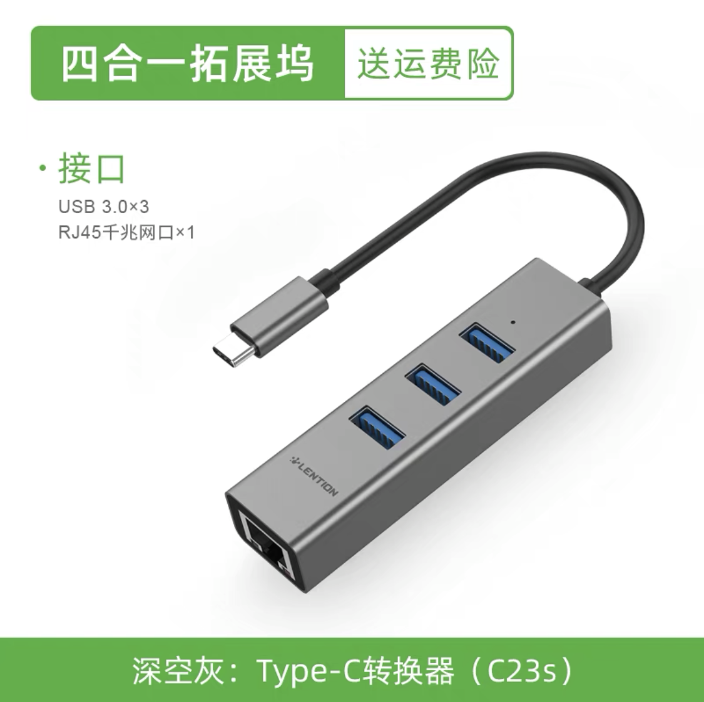
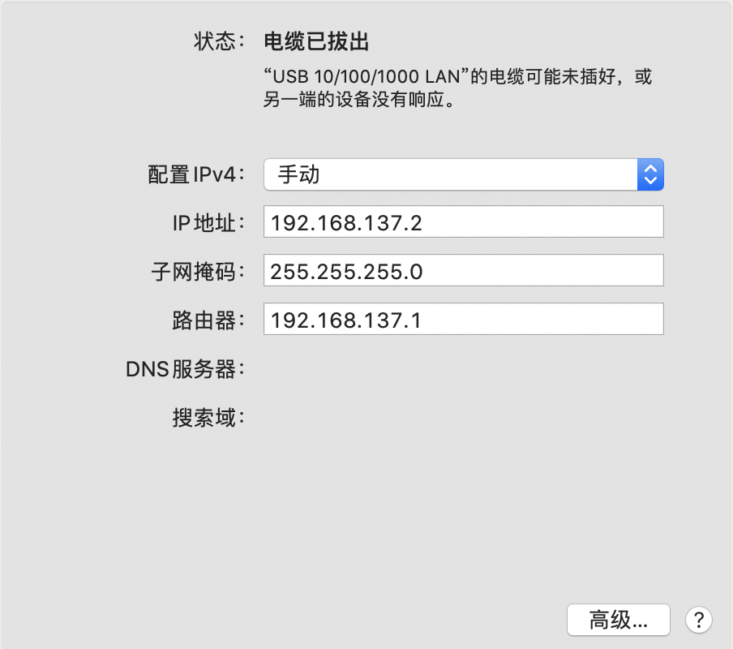
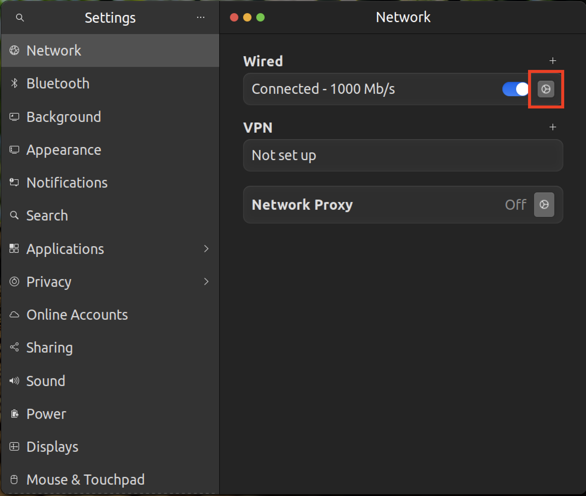
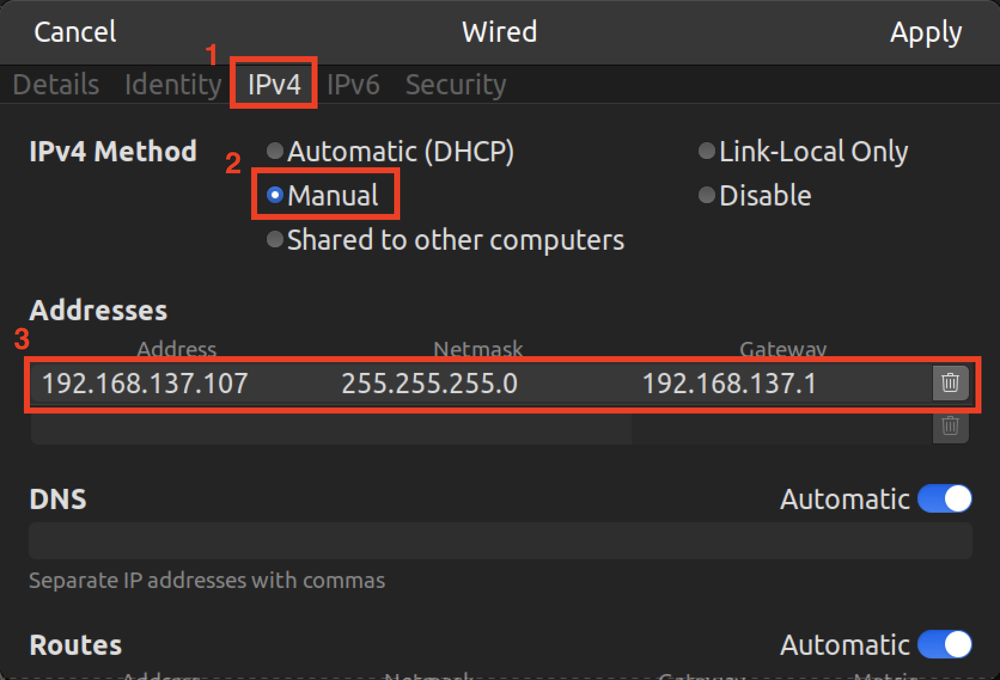

# Install VNC

## 前言

边缘计算平台通常没有显示设备，其本身就以小巧轻便为目的，配置一个显示器反而有些舍本求末了，再加上一些工作环境本身就不适合显示器存在，于是一种不通过显示器就能访问桌面的需求就产生了。

借助 VNC 工具，我们可以仅通过一根网线访问运算平台的桌面，这在一些场景将会很有帮助。我们知道，连接网线之后配置好 IP 地址、子网掩码和路由器，我们可以轻松地通过 ssh 登陆目标设备。但是，当目标设备是 Ubuntu 系统且没有自动登录时，我们无法建立 ssh 连接的。对于这些特殊的场景，我觉得，配置一个 VNC ，将会省去你很多的麻烦。更何况配置过程本身就不复杂，何乐而不为呢！

这里以 Tegra 处理器为例，理论上任何 ARM 架构的处理器上的 Linux 系统都通用。


## 安装步骤 for Tegra

### 安装 VNC 服务器

```bash
sudo apt update
sudo apt install vino
```

### 启用 VNC 服务器

启用每次登录时启动 VNC 服务器：

```bash
mkdir -p ~/.config/autostart
cp /usr/share/applications/vino-server.desktop ~/.config/autostart
```

配置 VNC 服务器：

```bash
gsettings set org.gnome.Vino prompt-enabled false
gsettings set org.gnome.Vino require-encryption false
```

设置访问 VNC 服务器的密码（将 `<your_password>` 替换为你的密码）：

```bash
gsettings set org.gnome.Vino authentication-methods "['vnc']"
gsettings set org.gnome.Vino vnc-password $(echo -n '<your_password>'|base64)
```

重启系统使设置生效：

```bash
sudo reboot
```

只有在本地登录 Jetson 后，VNC 服务器才可用。如果您希望 VNC 自动可用，请使用系统设置应用程序启用自动登录。

### 连接到 VNC 服务器

在你希望在远程操作的操作系统上安装 VNC 客户端应用程序。

为了连接，你需要知道 Linux 系统的 IP 地址：

```bash
ifconfig
```

在输出中搜索文本 `inet addr:` 后跟四个序列数字（可以这样实现 `ifconfig | grep <eth0>`），用于相关网络接口（例如 `eth0` 用于有线以太网， `wlan0` 用于 WiFi，或 `l4tbr0` 用于 USB 设备模式以太网连接）。

### 设置静态 IP 地址

为了防止 Linux 系统在不同的 Wi-Fi 中有不同的 IP 地址，或是 DHCP 每次分配了不一样的 IP 地址，我们可以使用网线来连接它，这样，我们可以通过这根网线配置一个局域网，而 IP 地址都是手动静态的了。

在你的电脑主机上，配置网口或者拓展坞的 IP 地址、子网掩码和路由器。我们以常见的 Windows 系统和 MacOS 系统为例。

对于 MacOS 系统，一般较新的苹果电脑是没有网口的，因此需要插上拓展坞，这里给出一个可用的产品（非广告，不提供链接）：



然后插上电脑后，点击`设置`->`网络`，会出现一个新的网卡连接，配置 IPv4 为手动，然后按照你的需求设置其他选项，点击应用就完成了。



对于 Windows 系统，TODO


在 Linux 系统中，以 Ubuntu 系统中为例，运行 `Settings` 软件，点击 `Network` ，点击 `Wired` 中右侧设置图标：



点击 `IPv4` ，点击 `Manual` ，在 `Addresses` 中添加 `IP 地址`、`子网掩码`和`网关`，注意这里的子网和网关必须和远程操作机上的一致，而 IP 地址必须不同，且都不和网关 IP 冲突：



### 设置桌面分辨率

如果未连接显示器，则默认为选择了 $640\times480$ 的分辨率。要使用不同的分辨率，请编辑 `/etc/X11/xorg.conf` 并附加以下几行：

```conf
Section "Screen"
   Identifier    "Default Screen"
   Monitor       "Configured Monitor"
   Device        "Tegra0"
   SubSection "Display"
       Depth    24
       Virtual 1280 800 # 将这些值
   EndSubSection
EndSection
```


## 参考文献

1.   链接: _<https://pan.baidu.com/s/11QKGlXG_p99FQEzr7eV2tQ>_ 提取码: 0omm


-----

作者：Harry-hhj，github主页：[传送门](https://github.com/Harry-hhj)

