# RM 教程 3 —— OpenCV 传统视觉

> 机械是血肉，电控是大脑，视觉是灵魂。

---

本片教程主要集中于边缘及轮廓检测。

## 一、OpenCV 基本组件 - Mat

`Mat` 是 OpenCV 中常用的基本类型，即矩阵类。在计算机内存中，数字图像以矩阵的形式存储和运算，因此 OpenCV 中常常用 `Mat` 储存图像数据。

**`Mat` 本质上由两个数据部分组成：矩阵头和一个指向像素数据的指针。**矩阵头部的大小是恒定的。然而，矩阵本身的大小因图像的不同而不同。这一数据结构的好处是： `Mat` 的每个对象具有其自己的头，但可通过矩阵指针指向同一地址让两个实例之间共享该矩阵。**除非你明确指明需要复制数据，不然 Mat 只会复制矩阵头部，并将数据指针指向同一地址，而不会复制矩阵本身。**

### 1）构造函数

`Mat` 常用的构造方式有两种：

-   `Mat()` ：这种 `Mat` 由于未定义维度和大小，无法直接使用，一般用来接收函数的输出，被重新赋值
-   `Mat (int rows, int cols, int type)` ：创建一个行数为 `rows` ，列数为 `cols` ，数据类型为 `type` 的矩阵。
    -   `type` ：**`CV_[位数][有无符号][数据类型][通道数]`** ，对于图片值一般为 `CV_8UC3` ，其中 `8U` 代表 8 位无符号整数， `C3` 代表 3 通道，这是一般用来储存 3 通道图像的格式。当然 `type` 还有很多其他类型，例如 `CV_64FC1` 表示一般的实数矩阵。

### 2）初始化

初始化一个矩阵有两种方式：等号赋值或 `create()` 成员函数 。

```c++
cv::Mat src = imread("logo.png");

cv::Mat src;
if (src.empty()) {
    src.create(3, 3, CV_8UC3);  // 这种方法创建的内存空间一定是连续的
}
```

### 3）成员变量和函数

比较常用的获取矩阵信息的变量和函数有：

```c++
cv::Mat src1(3, 3, CV_8UC3);

std::cout << src1.cols << std::endl;  // 图片行数：3
std::cout << src1.rows << std::endl;  // 图片列数：3
std::cout << src1.channels() << std::endl;  // 图片通道数，注意是成员函数：3
```

### 4）拷贝

通过下面这个例子，你会很容易理解为什么当我们想复制数据时必须显示指明：

```c++
cv::Mat src2(4, 4, CV_8UC3);
std::cout << "Pointer src2.data points to" << (void*)src2.data << std::endl;
cv::Mat src2_copy1 = src2;
std::cout << "Pointer src2_copy1.data points to" << (void*)src2_copy1.data << std::endl;
cv::Mat src2_copy2 = src2.clone();
std::cout << "Pointer src2_copy2.data points to" << (void*)src2_copy2.data << std::endl;
```

程序运行结果：

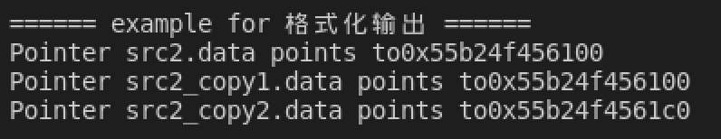

可以看到通过等号赋值的 `src2_copy1` 的指针与 `src2` 指向同一片内存地址，这意味着对任意一个变量的操作会影响另一个，而通过使用 `clone()` ，系统为新的变量 `src_copy2` 创建了一块新的内存空间，并把原始变量拷贝了过去。

除了 `clone()` 外，成员函数 `copyto(cv::Mat dst)` 也有相同的效果。

TODO：refcount

### 5）格式化输出

使用 `std::cout` 来格式化输出 `Mat` 类型的变量，仅限于二维的。

```c++
cv::Mat src3 = cv::Mat::zeros(5, 5, CV_64F);
// 默认格式
std::cout << src3 << std::endl;
// python 格式
std::cout << cv::format(src3, cv::Formatter::FMT_PYTHON) << std::endl;
// C 格式
std::cout << cv::format(src3, cv::Formatter::FMT_C) << std::endl;
// numpy 格式
std::cout << cv::format(src3, cv::Formatter::FMT_NUMPY) << std::endl;
```

输出结果如下：


### 6）矩阵的随机访问

Mat 类型本身没有实现 [] 的随机访问，因此如果想要随机访问矩阵中的元素，需要其他方法。

-   `Mat` 提供了 `at` 方法，其声明如下：

    ```c++
    template<typename _Tp >
    _Tp& cv::Mat::at(int row, int col)
    ```

    通过 `at` 方法，可以随机访问 row 行 col 列的元素，下面是一个简单的例子：

    ```c++
    cv::Mat src4 = cv::Mat::eye(3, 3, CV_8UC1);
    src4.at<uint8_t>(1, 1) = static_cast<uint8_t>(2);
    std::cout << src4 << std::endl;
    ```

    从结果可以看出，第 1 行 1 列的元素从 $1$ 变成了 $2$ ：

    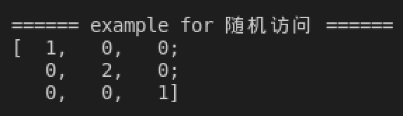

-   `Mat` 类提供的 `ptr` 方法也可以借助指针的方式实现随机访问，其声明如下：

    ```c++
     uchar* cv::Mat::ptr(int i0 = 0)
    ```

    通过 `ptr` 方法，可以返回矩阵第 `i0` 行的指针，通过指针进一步访问矩阵的元素，下面是一个 简单的例子：

    ```c++
    cv::Mat src5 = cv::Mat::eye(3, 3, CV_8UC1);
    uchar *ptr = src5.ptr(1);
    ptr[1] = 2;
    std::cout << src5 << std::endl;
    ```

    从结果可以看出，该代码达到了和 `at()` 一样的效果：

    

### 7）Mat 简单运算

-   复制 `clone()`

    为什么要使用 `clone()` 而不能使用 `=` 在上面已经讲过了，这里举个例子让读者直观感受两种操作的不同：

    ```c++
    cv::Mat src6 = cv::Mat::eye(3, 3, CV_8UC1);
    cv::Mat src6_copy1 = src6;
    cv::Mat src6_copy2 = src6.clone();
    src6.at<uint8_t>(1, 1) = 5;
    std::cout << "src6_copy1:\n" << src6_copy1 << std::endl;
    std::cout << "src6_copy2:\n" << src6_copy2 << std::endl;
    ```

    结果是 `=` 复制的矩阵 `src6_copy1` 被同时修改，而通过 `clone()` 复制的 `src6_copy2` 没有变化：

    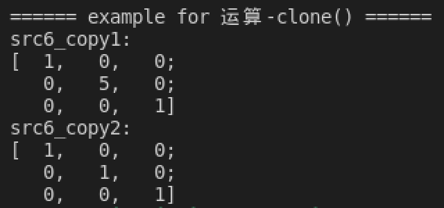

    **如果想要安全地复制，使用 OpenCV 提供的矩阵复制函数。**

-   `+` 、 `-` 、 `*`

    -   `+`

        OpenCV中重载了矩阵的 + 运算符，同时有 `virtual void cv::MatOp::add(const MatExpr &expr1, const MatExpr &expr2, MatExpr &res)` 方法实现了加法运算。

    -   `-`

        OpenCV中重载了矩阵的 - 运算符，同时有 `virtual void cv::MatOp::subtract(const MatExpr &expr1, const MatExpr &expr2, MatExpr &res)` 方法实现了减法运算。

    -   `*`

        OpenCV中重载了矩阵的 * 运算符，对应矩阵乘法。而 `void cv::multiply(const MatExpr &expr1, const MatExpr &expr2, MatExpr &res)` 函数**实现的是矩阵的对应位数据相乘，而不是矩阵乘法**。

        ```c++
        cv::Mat src7 = cv::Mat::eye(2, 2, CV_64FC1);
        cv::Mat src8 = (cv::Mat_<double>(2, 2) << 1, 1, 1, 1);
        std::cout << "src7 * src8 = \n" << src7 * src8 << std::endl;
        cv::Mat res;
        cv::multiply(src7, src8, res);
        std::cout << "cv::multiply(src7, src8, res) = \n" << res << std::endl;
        ```

        最终两种运算的结果是不同的：

        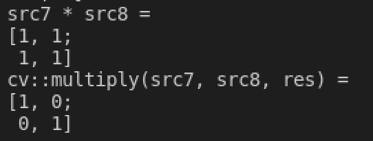

### 8）读写图片和视频

OpenCV 中提供了函数 `Mat cv::imread(const String &filename, int flags = IMREAD_COLOR)` 实现从指定文件中读取图片，通过函数 `cv::imwrite(const String &location, const cv::Mat &src)` 实现。

OpenCV 中提供了 `VideoCapture` 类完成读取视频的工作。

```c++
cv::VideoCapture cap(PROJECT_DIR"/assets/test.avi");
assert(cap.isOpened());
std::cout << (int)cap.get(cv::CAP_PROP_FRAME_HEIGHT) << " " << (int)cap.get(cv::CAP_PROP_FRAME_WIDTH) << std::endl;
cv::VideoWriter writer(PROJECT_DIR"/assets/test_copy.avi", cv::VideoWriter::fourcc('M', 'J', 'P', 'G'), 10, {(int)cap.get(cv::CAP_PROP_FRAME_WIDTH), (int)cap.get(cv::CAP_PROP_FRAME_HEIGHT)}, true);
cv::Mat src10;
cv::namedWindow("video");
std::cout << "press q to exit." << std::endl;
while (cap.read(src10)) {
    cv::imshow("video", src10);
    writer.write(src10);
    // writer << src10;
    char k = cv::waitKey(200);
    if (k == 'q') break;
}
cv::destroyWindow("video");
cap.release();
writer.release();
```


## 二、为什么要做边缘检测

大多数图像处理软件的最终目的都是识别与分割。识别即“是什么”，分割即“在哪里”。而为了将目标物体从图片中分割出来，如果这个物体有着鲜明的特征，使得目标物体和背景有着极大的区分度（如黑暗中的亮点，大面积的色块），我们就可以比较容易的将这个物体提取出来。

因为现在的目标物体和背景有着极大的区分度，也就意味着**目标和背景有着明显的“分界线”，也就是边缘**；而**多个连续的边缘点，就构成了这个物体的轮廓**。所以我们可以将检测物体这个任务，转换为检测物体和背景的分界线，也就是边缘检测。

## 三、如何进行边缘检测

在进行边缘检测之前，我们首先需要明确，我们想对图像中的哪种信息进行边缘检测。一般来讲，我们会**对图像的亮度信息进行边缘检测**，也就是在单色灰度图上检测边缘，此时检测到的边缘点是亮度变化较大的点。但有的时候，目标和背景的亮度差异不大，没法通过亮度边缘确定目标和背景的分界线；但目标和背景的颜色差异可能很大，这时就会**对图像的颜色信息进行边缘检测**，此时检测到的边缘点就是颜色变化最大的点。

在确定了我们想检测怎样的边缘后，我们就需要一个方法把边缘给找出来。下面介绍几个常用的方法（假设我们现在是要检测亮度边缘）

为了进行对一个图片的亮度进行判断，我们需要把一个 RGB 图片转成灰度图片，转换后越亮的像素点越接近白色（255），而越暗的像素点越接近黑色（0），图像由三通道变为单通道。其原理是：RGB 值和灰度的转换，实际上是人眼对于彩色的感觉到亮度感觉的转换，这是一个心理学问题，有一个公式：
$$
Grey = 0.299*R + 0.587*G + 0.114*B
$$
**可以通过将浮点数运算转化为整数运算，整数运算转换为位操作进行优化**。

在 OpenCV 中，提供了 `cv::cvtColor()` 函数完成各种颜色空间的转换：

```c++
void cv::cvtColor(cv::InputArray src, cv::OutputArray dst, int code, int dstCn = 0);  
```

例如对于下面这张图片：


我们通过以下代码将其转化为灰度图：

```c++
cv::Mat img = cv::imread(PROJECT_DIR"/assets/apple.jpg");
cv::Mat gray;
cv::cvtColor(img, gray, cv::COLOR_BGR2GRAY);
cv::imshow("gray", gray);
cv::waitKey(0);
```


有另一种方法是在读如图片时指定读取灰度图，但是由于其实用性较低，不与赘述。


### 1）二值化

由于目标和背景的亮度差异很大，那么最简单的想法就是设定一个阈值，亮度高于该阈值的像素设为目标，亮度低于该阈值的像素设为背景。而这两片区域的交界处便是边缘。

再特殊一点：目标的亮度不一定就是很高，或者很低，而是在一个范围内（如100~150），此时我们的二值化就和上面有一定的区别，将这两个阈值范围内的像素设为目标，不在该范围内的设为边缘。

更进一步：二值化指的是一个函数 `f(x)` ，其自变量是某个像素的亮度值，其因变量（或者说函数的输出）是 $255$ 或 $0$ ，分别代表目标和背景。

在 OpenCV 中，对应实现这一功能的函数是：

```c++
double cv::threshold(InputArray src, OutputArray dst, double thresh, double maxval, int type)
```

参数：

-   `src`：输入

-   `dst`：输出

-   `thres`：设定的二值化阈值

-   `maxval`：使用 THRESH_BINARY 或 THRESH_BINARY_INV 进行二值化时使用的最大值

-   `type`：二值化算法类型

    -   `THRESH_BINARY`：将小于 thres 的值变为 0 ，大于 thres 的值变为 255
    -   `THRESH_BINARY_INV`：将小于 thres 的值变为 255, 大于 thres 的值变为 0
    -   `THRESH_TRUNC`：将大于 thres 的值截取为 thres, 小于 thres 的值不变
    -   `THRESH_TOZERO`：将小于 thres 的值变为 0 , 大于 thres 的值不变
    -   `THRESH_TOZERO_INV`：将大于 thres 的值变为 0 , 小于 thres 的值不变

    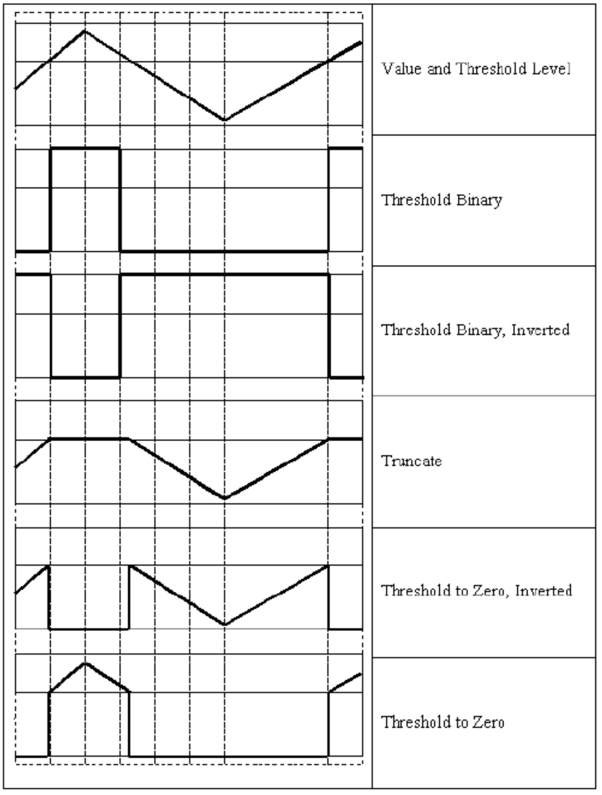

举个例子，现在我们需要将这样一种图进行二值化，提取其中棋盘格黑色的区域：

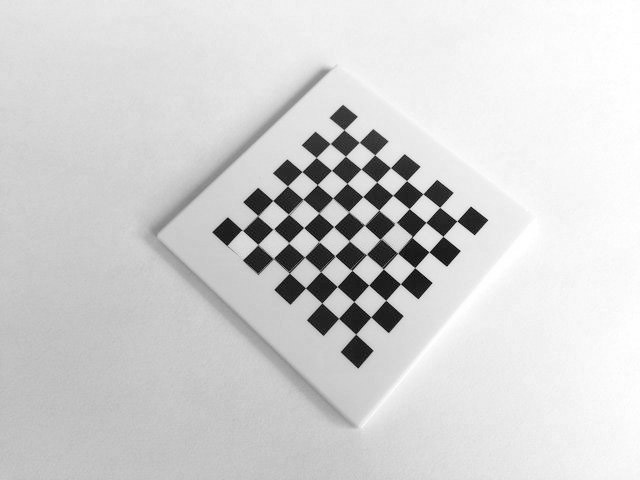

我们用下面这段程序实现了这一功能：

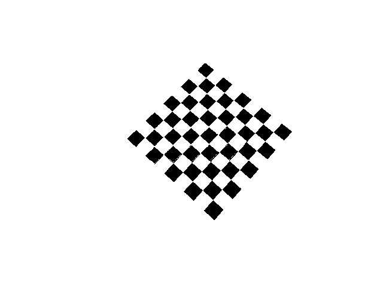

可以看到我们很好地提取出了黑色的部分。


### 2） 自适应二值化

#### 1. 全局自适应

由于图片的亮度很容易受到环境的影响，比如环境亮度不同，相机曝光不同等因素都可能影响到最终成像出来的图片的亮度。这样，原本在较亮环境下设定的 180 的亮度阈值可以较好和分割出目标，到了较暗环境下效果就变差，甚至完全不起作用了。

但是环境对成像图片亮度的影响是整体的，也就是说整张图片一起变亮或者一起变暗，原本比背景亮的目标物体，在较暗环境下同样应该比背景亮。

基于这一点，我们可以提出一个简易的自适应二值化方法：对图像所有像素的亮度值进行从大到小排序，取前 20%（该数值为人为设定的阈值参数）的像素作为目标，其余为背景。

OpenCV 中常用的方法有 `大津二值化` 方法。对于之前提到的函数 `threshold()` ，当 `type = cv::THRESH_OTSU` 时，参数 `thresh` 无效，具体数值由大津法自行计算，并在函数的返回值中返回。

下面是一个使用 `大津法` 计算 `thresh` 的例子。

```c++
double thres = cv::threshold(src, binary_img, 100, 255, cv::THRESH_OTSU);
```

程序运行的结果与手动设定阈值的结果相似。

**但是设定单一阈值的方法仍然有明显的缺点，对于一张图中有明显的光线亮度渐变的图像，单一阈值往往难以起到好的效果。**

#### 2. 局部自适应

例如下图这张图片，左侧的亮度明显高于右下角：

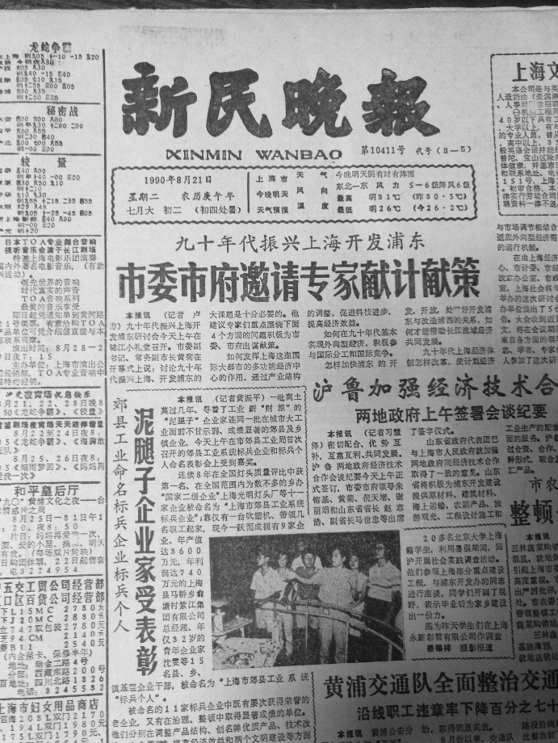

如果使用大津法自动求阈值并直接二值化，会得到类似下图的结果：

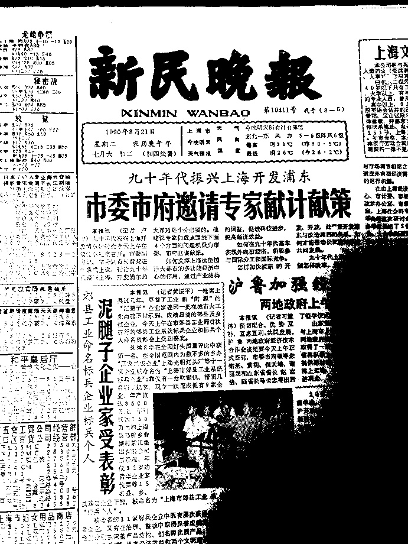

为了解决这种问题，我们需要对每个区域局部适应区域内的灰度情况，对每个区域使用不同的阈值分别二值化。 OpenCV 中提供了 `adaptiveThreshold` 方法实现这一功能。
函数的声明如下：

```c++
void cv::adaptiveThreshold(InputArray src, OutputArray dst, double maxValue, int adaptiveMethod, int thresholdType, int blockSize, double C)
```

其中：

-   `adaptiveMethod` 为自适应二值化算法使用的方法；
-   `blockSize` 为自适应二值化的算子大小，注意必须为奇数；
-   `C` 为用来手动调整阈值的偏置量大小。

自适应二值化算法的运行结果如下：

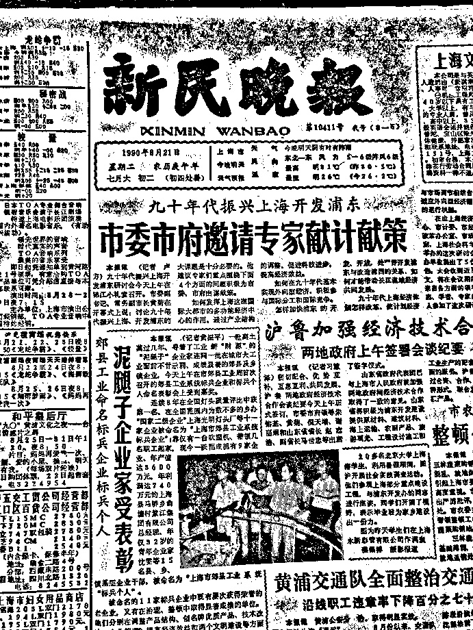


### 3） 基于梯度的边缘

在上述全局的方法中，通过一个阈值将整张图片分为两个部分，而两部分的交界处就作为边缘。这样的一个做法还有另一个缺点，如果图像中有一片区域亮度从低逐渐过渡到高，二值化同样会把这片区域分为两块。即，二值化得出的边缘，并不一定是图像中亮度变化最大（或较大）的地方。由于目标和背景亮度差异较大，所以交界处一定是图像中亮度变化最大（或较大）的地方。

为了解决该问题，还可以使用基于梯度的边缘。二值化和梯度检测是两种不同的方法。其基本思想是：首先计算图片中每个像素点的亮度梯度大小（一般使用Sobel算子），然后设定一个阈值，梯度高于该阈值的作为边缘点。同样，类似与自适应二值化，这个阈值也可以设定成一个比值。

在实际使用中，我们通常会使用 Canny 算法进行基于梯度的边缘检测，这个算法中做了很多额外措施，使得边缘检测的效果较好。

OpenCV 中 Canny 算法的函数声明如下：

```c++
void cv::Canny(InputArray image, OutputArray edges, double threshold1, double threshold2, int apertureSize = 3, bool L2gradient = false)
```

对于下面这张图：

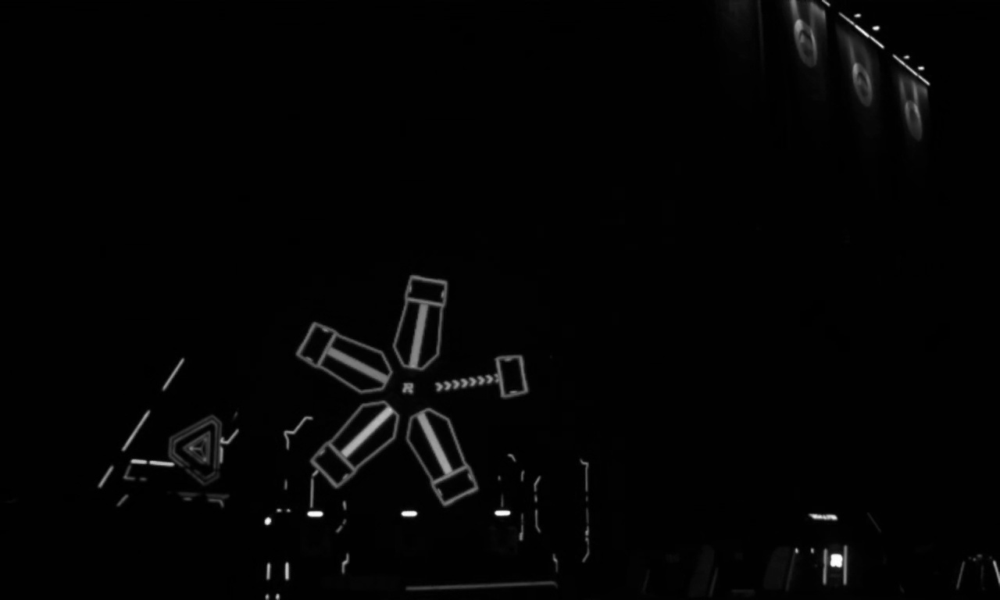

我们使用下面的程序进行梯度边缘检测：

```c++
cv::Mat task3_img = cv::imread(PROJECT_DIR"/assets/energy.jpg", cv::IMREAD_GRAYSCALE);
cv::Mat task3_result;
cv::Canny(task3_img, task3_result, 125, 225, 3);
cv::imshow("task3_canny", task3_result);
cv::waitKey(0);
```

程序的结果是：

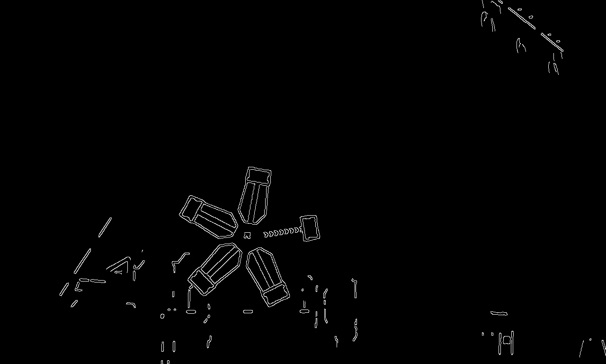


### 4）补充：检测颜色边缘

在上面几种方法中，我们都是进行亮度边缘检测，亮度边缘检测有一个明显的特征，即每个像素的亮度都可以用一个数值进行表达。但当我们想进行颜色边缘检测时，我们似乎并不能用一个数值来表达该像素的颜色差异，必须使用 RGB 三通道数值才能表达一个像素的颜色。

首先，在 RGB 颜色表示方法中，每个颜色分量都包含了该像素点的颜色信息和亮度信息。我们希望对 RGB 颜色表示进行一个变换，使得像素点的颜色信息和亮度信息可以独立开来。为此，我们可以使用 HSV 颜色空间。


_hsv 六棱锥_

在 HSV 颜色空间中， H 分量代表色度，即该像素是哪种颜色； S 分量代表饱和度； V 分量代表亮度（和光强度之间并没有直接的联系）。这种颜色表示方法很好地将每个像素的颜色、饱和度和亮度独立开。至于 RGB 颜色空间如何转换为 HSV 颜色空间，这里不作介绍，有兴趣可以自行百度。

有了 HSV 颜色空间，由于其 H 通道就代表了像素的颜色，我们就可以在 H 通道上使用上述几种边缘检测方式，从而得出颜色边缘。

以下是几种常见颜色的 hsv 阈值，每种颜色对应 HSV 空间中的一块区域，在各通道上呈现一个或两个区间：


这些数值可以作为调参的一个初值。

OpenCV 提供了 `inRange()` 函数完成区间的筛选：

```c++
void cv::inRange(InputArray src, InputArray lowerb, InputArray upperb, OutputArray dst)
```

其中 lowerb 和 upperb 分别对应 HSV 空间中坐标范围的下界和上界。

如果需要提取多个 HSV空间范围中的颜色，那么需要执行多次 inRange 并将得到的颜色取并集。

我们以下图为例：

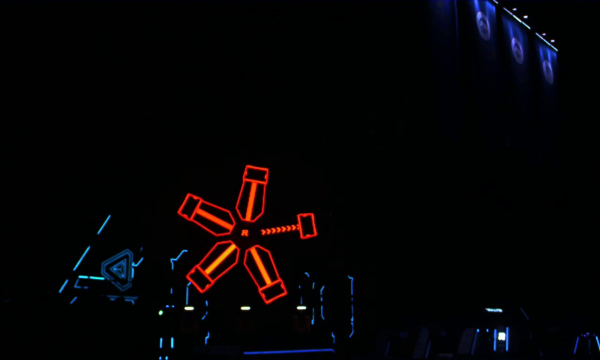

我们想要提取的颜色为红色和橙色的区域，通过百度搜索，我们了解到红色和橙色的颜色在 HSV 空间中处于区间 $[(0, 43, 46), (255, 255, 255)] \cup [(156, 43, 46), (180, 255, 255)]$ 中。

```c++
cv::Mat task4_img = cv::imread(PROJECT_DIR"/assets/energy.jpg");
cv::Mat task4_hsv;
cv::cvtColor(task4_img, task4_hsv, cv::COLOR_BGR2HSV);
cv::Mat task4_hsv_part1, task4_hsv_part2;
cv::inRange(task4_hsv, cv::Scalar(0, 43, 46), cv::Scalar(25, 255, 255), task4_hsv_part1);
cv::inRange(task4_hsv, cv::Scalar(156, 43, 46), cv::Scalar(180, 255, 255), task4_hsv_part2); // 提取红色和橙色
cv::Mat task4_ones_mat = cv::Mat::ones(cv::Size(task4_img.cols, task4_img.rows), CV_8UC1);
cv::Mat task4_hsv_result = 255 * (task4_ones_mat - (task4_ones_mat - task4_hsv_part1 / 255).mul(task4_ones_mat - task4_hsv_part2 / 255));
// 对hsv_part1的结果和hsv_part2的结果取并集
cv::imshow("hsv", task4_hsv_result);
cv::waitKey(0);
```

程序结果如下：

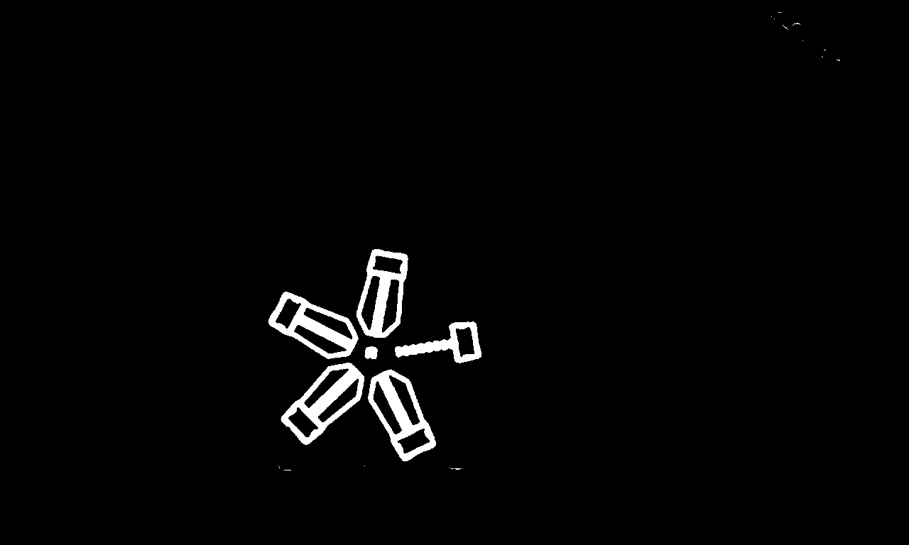

当然， HSV 颜色提取虽然是一种非常优秀的二值化方法，但他也存在自己的局限性。例如亮度的变化会对 HSV 数值造成干扰。同时，在实际使用过程中，如果相机的感光元件敏感度较高，也会造成图像中出现噪点，形成椒盐噪声。此外，在感光角度不同时，相机获取到的颜色饱和度和色相也会发生一定程度的变化，造成 HSV空洞 。

这里我们顺便提供一段 HSV 的调参界面代码：

```c++
void HSV_calib(const cv::Mat img, int *thres, int mode) {
    // mode: 0 for red; 1 for green; 2 for blue;
    cv::Mat imgHSV;
    cv::cvtColor(img, imgHSV, cv::COLOR_BGR2HSV);

    cv::namedWindow("Control", cv::WINDOW_AUTOSIZE); //create a window called "Control"
    thres[0] = (mode == 0) ? 156 : ((mode == 1) ? 100 : 35);
    thres[1] = (mode == 0) ? 180 : ((mode == 1) ? 140 : 70);
    thres[2] = (mode == 0) ? 43 : ((mode == 1) ? 90 : 43);
    thres[3] = (mode == 0) ? 255 : ((mode == 1) ? 255 : 255);
    thres[4] = (mode == 0) ? 46 : ((mode == 1) ? 90 : 43);
    thres[5] = (mode == 0) ? 255 : ((mode == 1) ? 255 : 255);
    //Create trackbars in "Control" window
    cv::createTrackbar("LowH", "Control", &thres[0], 179); //Hue (0 - 179)
    cv::createTrackbar("HighH", "Control", &thres[1], 179);
    cv::createTrackbar("LowS", "Control", &thres[2], 255); //Saturation (0 - 255)
    cv::createTrackbar("HighS", "Control", &thres[3], 255);
    cv::createTrackbar("LowV", "Control", &thres[4], 255); //Value (0 - 255)
    cv::createTrackbar("HighV", "Control", &thres[5], 255);
    std::vector<cv::Mat> hsvSplit;
    //因为我们读取的是彩色图，直方图均衡化需要在HSV空间做
    cv::split(imgHSV, hsvSplit);

    cv::equalizeHist(hsvSplit[2], hsvSplit[2]);
    cv::merge(hsvSplit, imgHSV);
    cv::Mat imgThresholded;
    while (true) {
        cv::inRange(imgHSV, cv::Scalar(thres[0], thres[2], thres[4]), cv::Scalar(thres[1], thres[3], thres[5]),
                    imgThresholded); //Threshold the image

        //开操作 (去除一些噪点)
        cv::Mat element = getStructuringElement(cv::MORPH_RECT, cv::Size(5, 5));
        cv::morphologyEx(imgThresholded, imgThresholded, cv::MORPH_OPEN, element);

        //闭操作 (连接一些连通域)
        cv::morphologyEx(imgThresholded, imgThresholded, cv::MORPH_CLOSE, element);

        cv::imshow("Thresholded Image", imgThresholded); //show the thresholded image
        cv::imshow("Original", img); //show the original image

        char key = (char) cv::waitKey(300);
        if (key == 27) {
            cv::destroyWindow("Control");
            break;
        } else continue;
    }
}
```


## 四、边缘检测的后处理

不论是使用二值化、还是自适应二值化、还是基于梯度的边缘检测方法，其检测结果都不可能正好分毫不差的将目标完整保留下来，并将背景完全剔除。即使图像质量极佳，或者目标特征极为明显，使得正好将目标和背景区分开，检测结果也还停留于像素层面，即每个像素是目标还是背景，而我们想要的则是目标在哪片区域。

所以后处理的目的主要有三个：**剔除错误的背景边缘、补充缺失的目标边缘、将目标表达成一个区域**。

对于前两点，我们通常会首先使用开闭运算处理二值化图或边缘图（取决于之前你采用的策略）。其中开运算连接断开区域，闭运算删除游离的噪声区域。详细算法的计算方式，这里不作介绍，有兴趣可以自行百度。图像滤波亦能达到类似的效果。

对于第三点，我们会使用轮廓检测。轮廓可以理解为一系列连通的边缘点，并且这些边缘点可以构成一个闭合曲线。

### 1）滤波

滤波通常是对二值化方法使用的。在对现实中的图像进行二值化时，二值化的结果往往难以达到最佳状态。许多情况下，二值化会产生空洞或形成噪点。在这种情况下就需要滤波和形态学运算这两大工具来提升二值化结果的质量。

滤波类似于卷积，有一个叫做算子的东西处理图像的局部特征。在开始之前，我们本节中的所有实例会针对以下图片进行。

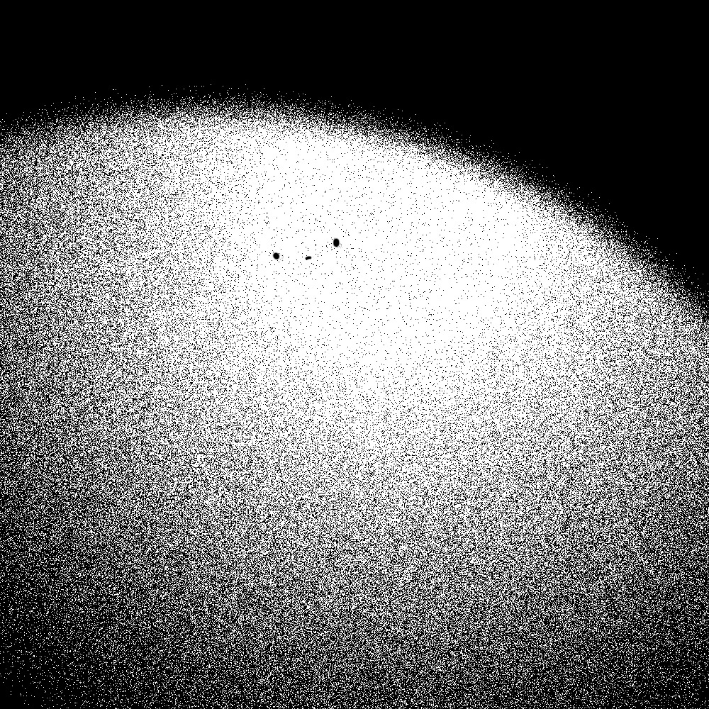

下面介绍几个比较常用的滤波算法。

#### 1. 均值滤波

均值滤波是最简单的滤波，也被成为线性平滑滤波。其算子可以表达为：
$$
K = \cfrac{1}{\text{ksize.width} \times \text{ksize.height}}
\begin{bmatrix}
1&1&\cdots&1\\
\vdots&\vdots&\ddots&\vdots\\
1&1&\cdots&1\\
\end{bmatrix}
$$
即对大小为 $M \times N$的矩形框内的像素取平均值。

OpenCV 中对应的函数是：

```c++
void cv::blur(InputArray src, OutputArray dst, Size ksize, Point anchor = Point(-1,-1), int borderType = BORDER_DEFAULT)
```

对例子中的图片应用均值滤波：

```c++
cv::Mat blured_img;
cv::blur(img, task5_blured_img, cv::Size(7, 7));
```

结果如下

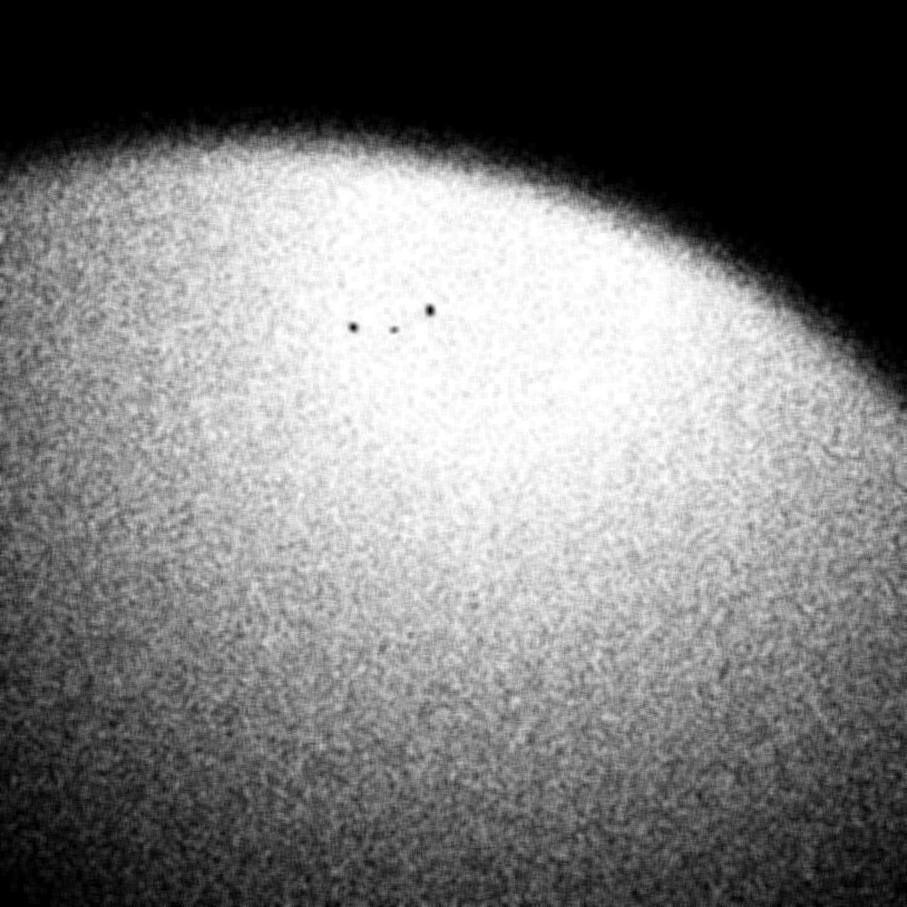

中值滤波的效果是使得图片更加模糊，削弱噪声的边缘梯度，使其看起来不那么显著，但是噪声本身并没有得到很好的消除，同时有用的信息也被削弱了。均值滤波是最快速的滤波算法之一，但同时它的效果却也不够理想，一般无法有效地去除椒盐噪声。

#### 2. 高斯滤波

高斯滤波通过对图像卷积高斯滤波算子实现滤波的效果。高斯算子如下：
$$
G(x, y) = \cfrac{1}{2\pi\rho^2} e^{-c\frac{x^2+y^2}{2\rho^2}}
$$
例如这就是一个高斯算子：
$$
\frac{1}{16} \times 
\begin{bmatrix}
1&2&1\\
2&4&2\\
1&2&1\\
\end{bmatrix}
$$
高斯算子的思想是：有用的信息会以一定的数量聚在一起，而噪声是随机游离的；最中间的信息对于该位数据最有用，但也应当考虑边缘信息的影响。

OpenCV 中对应的函数是：

```c++
void cv::GaussianBlur(InputArray src, OutputArray dst, Size ksize, double sigmaX, double sigmaY = 0, int borderType = BORDER_DEFAULT)
```

其中

-   `ksize` 为高斯算子的大小
-   `sigmaX` 和 `sigmaY` 为高斯函数在 x 和 y 方向上的偏置

对例子中的图片应用高斯滤波：

```c++
cv::Mat gaussian_blured_img;
cv::GaussianBlur(src, gaussian_blured_img, cv::Size(7, 7), 0, 0);
```

结果如下


可以看到虽然结果的噪声仍然很大，但图像在平滑效果和特征保留上相对均值滤波都有一定的提升，例如边缘信息更加明显一些。

#### 3. 中值滤波

中值滤波与前两者最大的不同在于，均值滤波和高斯滤波均为线性滤波，而中值滤波为非线性滤波。非线性滤波相对于线型滤波，往往都有更好的滤波效果，但代价是会有远高于线型滤波的时间开销。

中值滤波是基于排序统计理论的一种能有效抑制噪声的非线性信号处理技术，基本原理是把数字图像或数字序列中一点的值用该点的一个邻域中各点值的中值代替，让周围的像素值接近的真实值，从而消除孤立的噪声点。中值滤波对于滤除脉冲干扰及图像扫描噪声最为有效，还可以克服线性滤波器（如邻域简单平滑滤波）带来的图像细节模糊。

中值滤波算子不易用公式描述，总结如下：用某种结构的二维滑动模板，将板内像素按照像素值的大小进行排序，生成单调上升（或下降）的为二维数据序列。二维中值滤波输出为 $g(x,y)=med\{f(x-k,y-l),\  k,l \in W\}$ ，其中 $f(x,y)$ ， $g(x,y)$ 分别为原始图像和处理后图像。 $W$ 为二维模板，通常为 $3\times3$ ， $5\times5$ 区域，也可以是不同的的形状，如线状、圆形、十字形圆、环形等。

对例子中的图片应用中值滤波：

```c++
cv::Mat median_blured_img;
cv::medianBlur(src, median_blured_img, 7);
```

结果如下

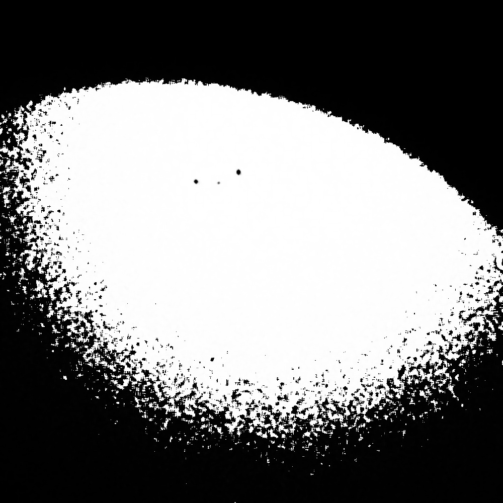

可以看到中值滤波在去除椒盐噪声上有着良好的表现，但在信息的保存上劣于高斯滤波。中值滤波不仅对孤立杂点的消除效果显著，对稍密集的杂点也有很好的去除效果。


### 2）形态学处理

形态学处理一般处理二值图像。

结构元（Structuring Elements）：一般有矩形和十字形。结构元有一个锚点 O ，O 一般定义为结构元的中心。下图是几个不同形状的结构元，紫红色块为锚点 O 。

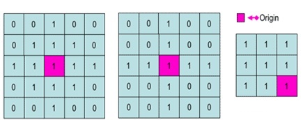

常见的形态学运算有腐蚀、膨胀、开闭，常用于中击不中变换、边界提取和跟踪、区域填充、提取连通分量、细化和像素化， 以及凸壳。

OpenCV 中构造结构元的函数是

```c++
cv::Mat getStructuringElement(int shape, cv::Size esize, cv::Point anchor = Point(-1, -1));
```

参数：

-   `shape` ：内核的形状，有三种形状可以选择
    -   `cv::MORPH_RECT` ：矩形
    -   `cv::MORPH_CROSS` ：交叉形
    -   `cv::MORPH_ELLIPSE` ：椭圆形

为了增强例子的可展示性，下面的例子中都采用了大结构元，但平时我们一般不会用那么大。

```c++
cv::Mat element = cv::getStructuringElement(cv::MORPH_CROSS, cv::Size(21, 21));
```


#### 膨胀 Dilation

将结构元 $s$ 在图像 $f$ 上滑动，把结构元**锚点位置的图像像素点**的灰度值设置为**结构元值为1的区域**对应图像区域像素的**最大值**。

膨胀运算示意图如下，从视觉上看图像中的前景仿佛“膨胀”了一样：

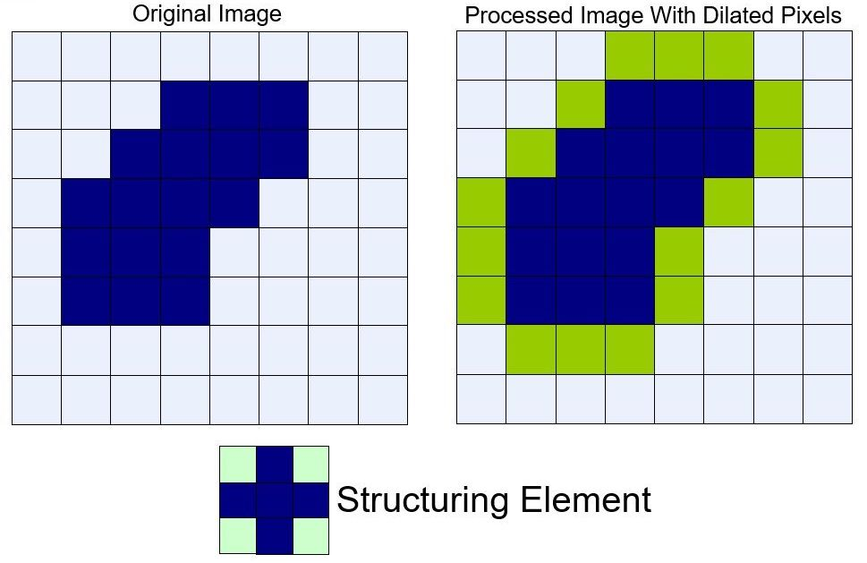

OpenCV 中的实现函数是

```c++
void dilate(InputArray src, OutputArray dst, InputArray kernel, Point anchor=Point(-1,-1), int iterations=1, int borderType=BORDER_CONSTANT, const Scalar& borderValue=morphologyDefaultBorderValue());
```

对中值滤波的结果图进行膨胀：

```c++
cv::Mat task7_src = task5_median_blured_img.clone();
cv::Mat element = cv::getStructuringElement(cv::MORPH_CROSS, cv::Size(21, 21));
cv::Mat task7_dilated;
cv::dilate(task7_src, task7_dilated, element);
cv::imshow("dilate", task7_dilated);
cv::waitKey(0);
```

效果如下：

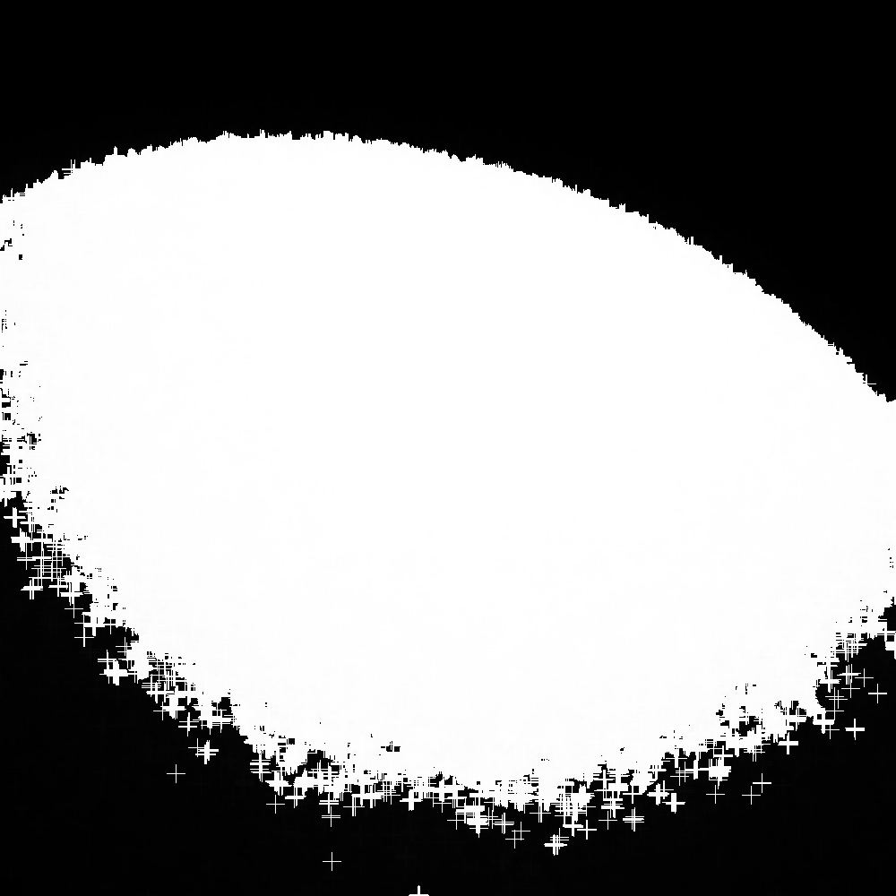


#### 腐蚀 Erosion

将结构元 $s$ 在图像 $f$ 上滑动，把结构元**锚点位置的图像像素点**的灰度值设置为**结构元值为 1 的区域**对应图像区域像素的**最小值**。

腐蚀运算示意图如下，从视觉上看图像中的前景仿佛被“腐蚀”了一样：

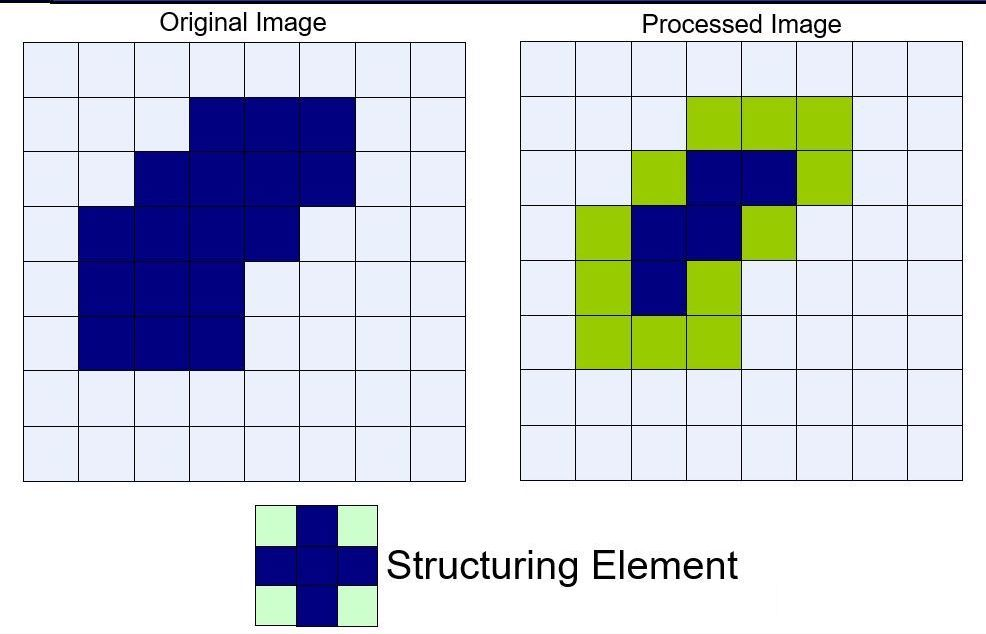

OpenCV 中的实现函数是

```c++
void erode(InputArray src, OutputArray dst, InputArray kernel, Point anchor=Point(-1,-1), int iterations=1, int borderType=BORDER_CONSTANT, const Scalar& borderValue=morphologyDefaultBorderValue());
```

对中值滤波的结果图进行膨胀：

```c++
cv::Mat task7_src = task5_median_blured_img.clone();
cv::Mat task7_eroded;
cv::erode(task7_src, task7_eroded, element);
cv::imshow("eroded", task7_eroded);
cv::waitKey(0);
```

效果如下：

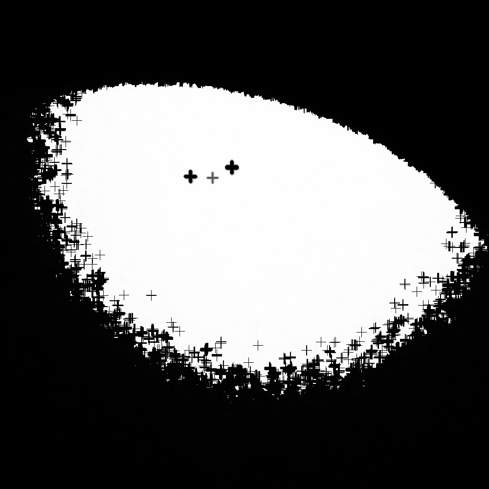


#### 开运算 Opening

对图像 $f$ 用同一结构元 $s$ 先腐蚀再膨胀称之为开运算。

开运算示意图如下，从视觉上看仿佛将原本连接的物体“分开”了一样：

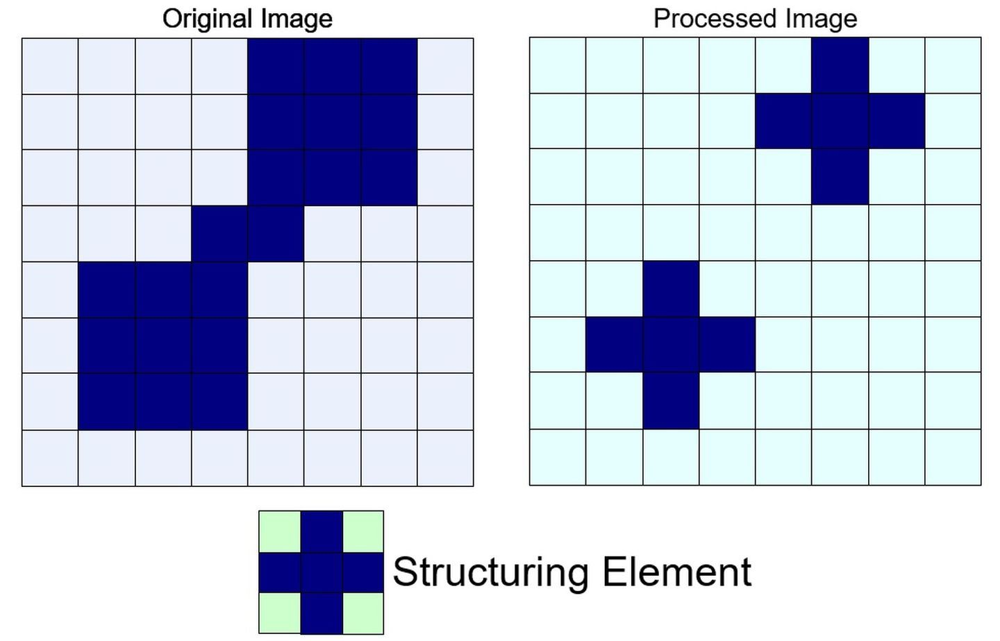

开运算能够除去孤立的小点，毛刺和小桥，而总的位置和形状不便。 

OpenCV 中的实现函数是

```c++
void morphologyEx(InputArray src, OutputArray dst, int op, InputArray kernel, Point anchor=Point(-1,-1), int iterations=1, int borderType=BORDER_CONSTANT, const Scalar& borderValue=morphologyDefaultBorderValue());
```

参数：

-   `op` ：表示形态学运算的类型
    -   `MORPH_OPEN` – 开运算（Opening operation）
    -   `MORPH_CLOSE` – 闭运算（Closing operation）
    -   `MORPH_GRADIENT` - 形态学梯度（Morphological gradient）
    -   `MORPH_TOPHAT` - 顶帽（Top hat）
    -   `MORPH_BLACKHAT` - 黑帽（Black hat）

对中值滤波的结果图进行膨胀：

```c++
cv::Mat task7_src = task5_median_blured_img.clone();
cv::Mat task7_opened;
cv::morphologyEx(task7_src, task7_opened, cv::MORPH_OPEN, element);
cv::imshow("open", task7_opened);
cv::waitKey(0);
```

效果如下：

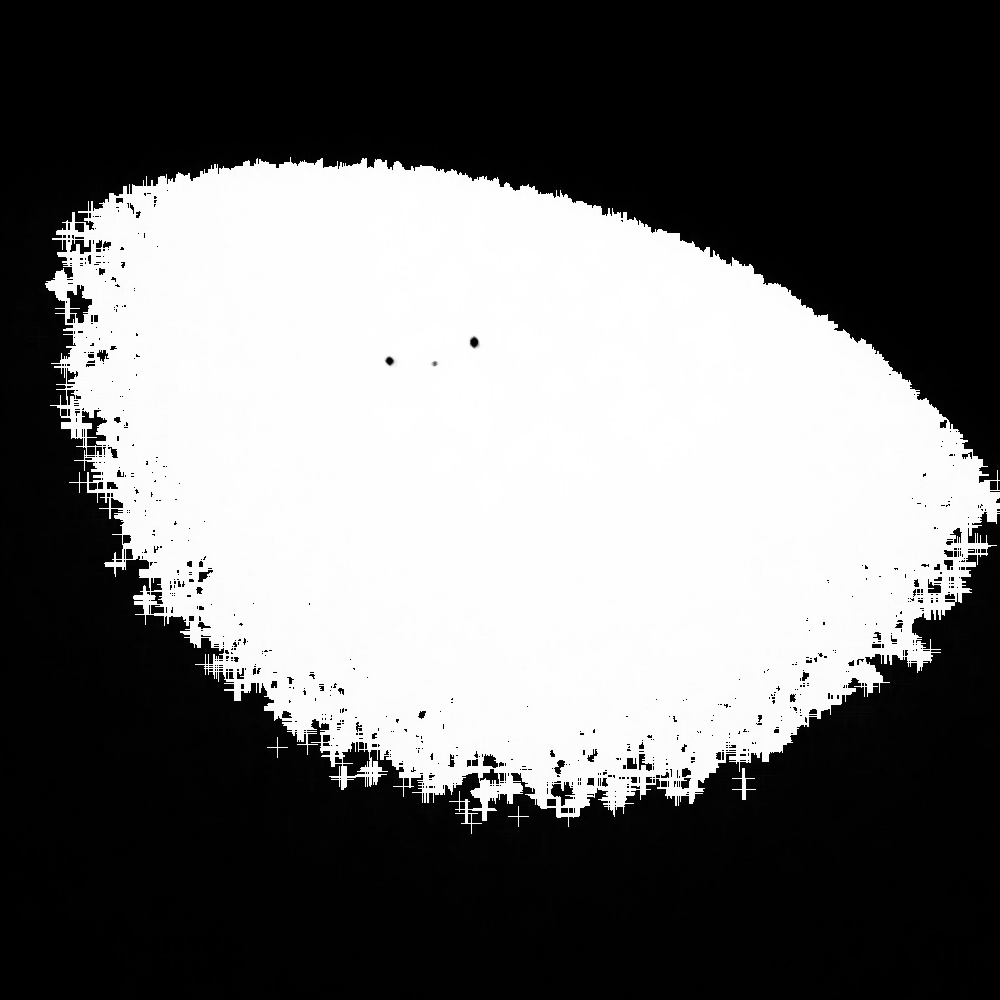


#### 闭运算 Closing

对图像 $f$ 用同一结构元 $s$ 先膨胀再腐蚀称之为闭运算。

开运算示意图如下，从视觉上看仿佛将原本分开的部分“闭合”了一样：

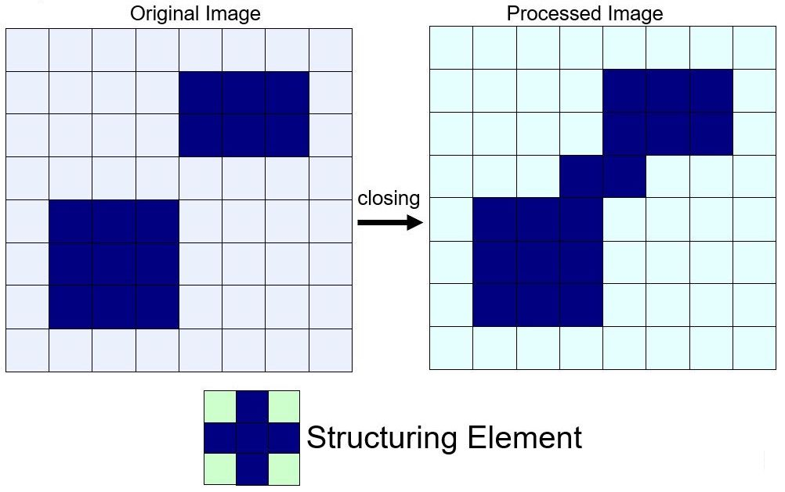

闭运算能够填平小湖（即小孔），弥合小裂缝，而总的位置和形状不变。 

OpenCV 中的实现函数同开运算。

对中值滤波的结果图进行膨胀：

```c++
cv::Mat task7_src = task5_median_blured_img.clone();
cv::Mat task7_closed;
cv::morphologyEx(task7_src, task7_closed, cv::MORPH_CLOSE, element);
cv::imshow("close", task7_closed);
cv::waitKey(0);
```

效果如下：

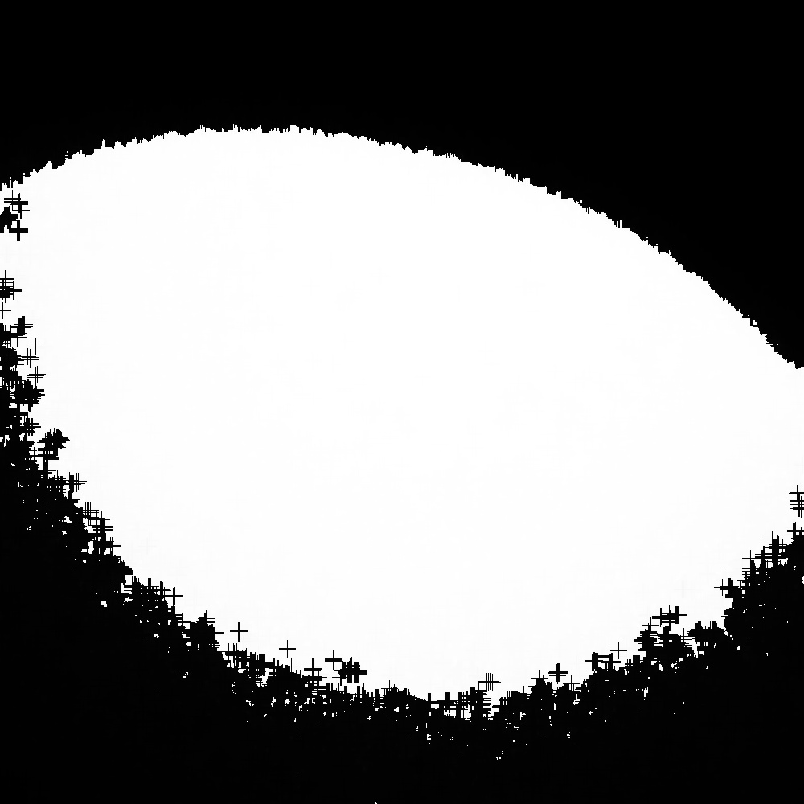


#### 其他

下面提供一段比较实用的代码，通过以下代码，你可以轻松地去除二值图中大于或者小于某一面积的区域而不需要进行轮廓提取：

```c++
// CheckMode:  0 代表去除黑区域， 1 代表去除白区域; NeihborMode： 0 代表 4 邻域， 1 代表 8 邻域;
void RemoveSmallRegion(cv::Mat &Src, cv::Mat &Dst, int AreaLimit, int CheckMode, int NeihborMode) {
    int RemoveCount = 0;       // 记录除去的个数
    // 记录每个像素点检验状态的标签， 0 代表未检查， 1 代表正在检查， 2 代表检查不合格（需要反转颜色）， 3 代表检查合格或不需检查
    cv::Mat Pointlabel = cv::Mat::zeros(Src.size(), CV_8UC1);

    if (CheckMode == 1) {
//        std::cout << "Mode: 去除小区域. ";
        for (int i = 0; i < Src.rows; ++i) {
            uchar *iData = Src.ptr<uchar>(i);
            uchar *iLabel = Pointlabel.ptr<uchar>(i);
            for (int j = 0; j < Src.cols; ++j) {
                if (iData[j] < 10) {
                    iLabel[j] = 3;
                }
            }
        }
    } else {
//        std::cout << "Mode: 去除孔洞. ";
        for (int i = 0; i < Src.rows; ++i) {
            uchar *iData = Src.ptr<uchar>(i);
            uchar *iLabel = Pointlabel.ptr<uchar>(i);
            for (int j = 0; j < Src.cols; ++j) {
                if (iData[j] > 10) {
                    iLabel[j] = 3;
                }
            }
        }
    }

    std::vector<cv::Point2i> NeihborPos;  // 记录邻域点位置
    NeihborPos.push_back(cv::Point2i(-1, 0));
    NeihborPos.push_back(cv::Point2i(1, 0));
    NeihborPos.push_back(cv::Point2i(0, -1));
    NeihborPos.push_back(cv::Point2i(0, 1));
    if (NeihborMode == 1) {
//        std::cout << "Neighbor mode: 8 邻域." << std::endl;
        NeihborPos.push_back(cv::Point2i(-1, -1));
        NeihborPos.push_back(cv::Point2i(-1, 1));
        NeihborPos.push_back(cv::Point2i(1, -1));
        NeihborPos.push_back(cv::Point2i(1, 1));
    }
    // else std::cout << "Neighbor mode: 4 邻域." << std::endl;
    int NeihborCount = 4 + 4 * NeihborMode;
    int CurrX = 0, CurrY = 0;
    // 开始检测
    for (int i = 0; i < Src.rows; ++i) {
        uchar *iLabel = Pointlabel.ptr<uchar>(i);
        for (int j = 0; j < Src.cols; ++j) {
            if (iLabel[j] == 0) {
                //********开始该点处的检查**********
                std::vector<cv::Point2i> GrowBuffer;  // 堆栈，用于存储生长点
                GrowBuffer.push_back(cv::Point2i(j, i));
                Pointlabel.at<uchar>(i, j) = 1;
                int CheckResult = 0;  // 用于判断结果（是否超出大小），0为未超出，1为超出

                for (int z = 0; z < GrowBuffer.size(); z++) {

                    for (int q = 0; q < NeihborCount; q++)  //检查四个邻域点
                    {
                        CurrX = GrowBuffer.at(z).x + NeihborPos.at(q).x;
                        CurrY = GrowBuffer.at(z).y + NeihborPos.at(q).y;
                        if (CurrX >= 0 && CurrX < Src.cols && CurrY >= 0 && CurrY < Src.rows)  // 防止越界
                        {
                            if (Pointlabel.at<uchar>(CurrY, CurrX) == 0) {
                                GrowBuffer.push_back(cv::Point2i(CurrX, CurrY));  // 邻域点加入buffer
                                Pointlabel.at<uchar>(CurrY, CurrX) = 1;  // 更新邻域点的检查标签，避免重复检查
                            }
                        }
                    }

                }
                if (GrowBuffer.size() > AreaLimit) CheckResult = 2;  //判断结果（是否超出限定的大小），1为未超出，2为超出
                else {
                    CheckResult = 1;
                    RemoveCount++;
                }
                for (int z = 0; z < GrowBuffer.size(); z++)  //更新Label记录
                {
                    CurrX = GrowBuffer.at(z).x;
                    CurrY = GrowBuffer.at(z).y;
                    Pointlabel.at<uchar>(CurrY, CurrX) += CheckResult;
                }
                //********结束该点处的检查**********


            }
        }
    }

    CheckMode = 255 * (1 - CheckMode);
    //开始反转面积过小的区域
    for (int i = 0; i < Src.rows; ++i) {
        uchar *iData = Src.ptr<uchar>(i);
        uchar *iDstData = Dst.ptr<uchar>(i);
        uchar *iLabel = Pointlabel.ptr<uchar>(i);
        for (int j = 0; j < Src.cols; ++j) {
            if (iLabel[j] == 2) {
                iDstData[j] = CheckMode;
            } else if (iLabel[j] == 3) {
                iDstData[j] = iData[j];
            }
        }
    }

//    std::cout << RemoveCount << " objects removed." << std::endl;
}
```


## 五、轮廓提取

不论是使用二值化还是边缘检测，最终得到的结果都是一个二值化了的图片，不论其中的点是表示物体信息还是边缘信息，我们都需要知道可能的目标的位置。因此它们最后都会被转化为轮廓，因为对这种边缘信息我们才能分析它的几何和拓扑特征。

OpenCV 中提供了轮廓提取函数：

```c++
void cv::findContours(InputArray image, OutputArrayOfArrays contours, OutputArray hierarchy, int mode, int method, Point offset = Point())
```

其中：

-   `mode` ：
    -   RETR_EXTERNAL：只列举外轮廓
    -   RETR_LIST：用列表的方式列举所有轮廓
    -   RETR_TREE：用列表的方式列举所有轮廓 用树状的结构表示所有的轮廓，在这种模式下会在 `hierachy` 中记录轮廓
-   `hierachy`：对于每一个轮廓， `hierarchy` 都包含 4 个整型数据，分别表示：后一个轮廓的序号、前一个轮廓的序 号、子轮廓的序号、父轮廓的序号。
-   `method` ：
    -   `CHAIN_APPROX_NONE` ：绝对的记录轮廓上的所有点
    -   `CHAIN_APPROX_SIMPLE` ：记录轮廓在上下左右四个方向上的末端点(轮廓中的关键节点)

下面演示如何使用 `RETR_TREE` 模式按照拓扑关系画出所有轮廓：

```c++
cv::Mat src = cv::imread(PROJECT_DIR"/assets/energy.jpg");
cv::Mat hsv;
cv::cvtColor(src, hsv, cv::COLOR_BGR2HSV);  // 将颜色空间从BGR转为HSV
cv::Mat hsv_part1, hsv_part2;
cv::inRange(hsv, cv::Scalar(0, 43, 46), cv::Scalar(25, 255, 255), hsv_part1);
cv::inRange(hsv, cv::Scalar(156, 43, 46), cv::Scalar(180, 255, 255), hsv_part2); // 提取红色和橙色
cv::Mat ones_mat = cv::Mat::ones(cv::Size(src.cols, src.rows), CV_8UC1);
cv::Mat hsv_result = 255 * (ones_mat - (ones_mat - hsv_part1 / 255).mul(ones_mat - hsv_part2 / 255));  // 对hsv_part1的结果和hsv_part2的结果取并集
std::vector<std::vector<cv::Point>> contours;
std::vector<cv::Vec4i> hierachy;
cv::findContours(hsv_result, contours, hierachy, cv::RETR_TREE, cv::CHAIN_APPROX_NONE);
cv::Mat drawer = cv::Mat::zeros(cv::Size(src.cols, src.rows), CV_8UC3);
for (int i = 0; i + 1; i = hierachy[i][0]) dfs(drawer, contours, hierachy, i, 0);  // 遍历所有轮廓
cv::imshow("src", src);
cv::imshow("contours", drawer);
cv::waitKey(0);
```

实现效果如图：

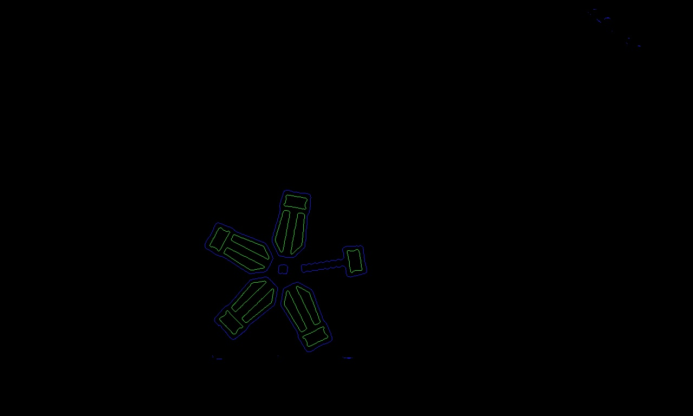


## 六、筛选

仅仅使用开闭运算，对三个目标中的前两点的改善十分有限，为了进一步从大量边缘中找到目标边缘，我们在进行完轮廓提取后，还会进行形状筛选。即根据目标的形状信息，剔除形状不正确的的轮廓（这里的形状同样包括大小等各种目标独特的特征）。形状筛选的方式通常有：计算轮廓面积、计算最小外接矩形、椭圆拟合、多边形拟合等。

更准确地说，我们对提取出的轮廓使用先验信息和分类器进行筛选，从而找到我们所需要的目标。具体使用什么方法是和目标有关的。

下面列举几个常用轮廓筛选的手段：

### 1）面积/周长大小约束

面积/周长大小约束是最简单的约束之一，即通过轮廓所包含区域的大小或是轮廓的周长大小筛选指定的轮廓。

这种方法虽然简单粗暴，但对于一些环境干扰小的简单环境往往能够取得相当不错的效果。下面是一个简单的例子：

```c++
bool judgeContourByArea(const std::vector<cv::Point> &contour)
{
    if (cv::contourArea(contour) > 2000) // 舍弃小轮廓
        return true;
    return false;
}
```

它对能量机关的轮廓提取如图：


这种方法简单高效，但也尤其缺点，确定是**鲁棒性低，容易受干扰**，对于每一个场景往往**需要针对输入调参**后才能使用。

### 2）轮廓凹凸性约束

这种方法能通过轮廓的凹凸性对凹轮廓或凸轮廓进行有针对性的筛选。一般来说可以通过将``轮廓的凸包``与``轮廓本身``进行比较来实现。

常用的比较方法有：

* 面积比例比较
    * 对于凸轮廓，轮廓的凸包面积与轮廓本身的面积比应该接近 $1:1$ ，而一般的凹轮廓的比值应该明显大于 $1$ 。
* 周长比值比较
    * 一般来说，对于凸轮廓，轮廓的凸包周长和轮廓本身的周长相近，而凹轮廓的轮廓本身周长应当明显大于凸包周长。

下面是一个简单的例子，筛选轮廓中的凹轮廓：

```c++
bool judgeContourByConvexity(const std::vector<cv::Point> &contour)
{
    if (contourArea(contour) < 500)  // 去除过小轮廓的干扰
        return false;
    double hull_area, contour_area;

    std::vector<cv::Point> hull;
    cv::convexHull(contour, hull);

    hull_area = cv::contourArea(hull);
    contour_area = cv::contourArea(contour);
    if (hull_area > 1.5 * contour_area)  // 判断凹凸性
        return true;
    return false;
}
```

它对能量机关的提取如图：


### 3）与矩形相似性约束

在轮廓筛选时常常会需要筛选一些较规则的形状，如矩形轮廓等。在这种情况下，一般来说我们可以通过将``轮廓的最小外接矩形``与``轮廓本身``进行比较来实现筛选。

常见的筛选方法与凹凸性约束相似，**也是通过面积和周长比较来实现**。此外，由于矩形的特殊性，也可以通过**矩形的长宽比**进行筛选。

下面是一个简单的例子，筛选能量机关的装甲板轮廓：

```c++
bool judgeContourByRect(const std::vector<cv::Point> &contour)
{
    if (cv::contourArea(contour) < 500)     // 排除小轮廓的干扰
        return false;
    double rect_area, contour_area, rect_length, contour_length;

    cv::RotatedRect rect = cv::minAreaRect(contour);
    rect_area = rect.size.area();
    contour_area = cv::contourArea(contour);

    if (rect_area > 1.3 * contour_area)    // 轮廓面积约束
        return false;
    rect_length = (rect.size.height + rect.size.width) * 2;
    contour_length = cv::arcLength(contour, true);
    if (std::fabs(rect_length - contour_length) / std::min(rect_length, contour_length) > 0.1)         // 轮廓周长约束
        return false;
    if (std::max(rect.size.width, rect.size.height) / std::min(rect.size.width, rect.size.height) > 1.9)       // 长宽比约束
        return false;
    
    return true;
}
```

运行结果如图：


<br/>

以上几种方法是主要的几种基于``单个轮廓本身几何性质``的筛选方法，下面介绍几种轮廓间几何关系的约束。

### 4）拓扑关系约束

在一张复杂的图片中，轮廓中往往有各种复杂的拓扑关系。

例如一个轮廓，它的拓扑关系可能有以下几种主要性质：

* 是否是最外层轮廓
* 是否是最内层轮廓
* 是否有子轮廓
    * 子轮廓的个数是多少
* 它是谁的子轮廓
* ……

例如当我们想筛选未被激活的装甲板，我们会发现他有两个拓扑关系：

1. 它是最外层轮廓
2. 它有一个子轮廓

再或者我们想筛选已经被激活的装甲板，我们会发现他也有连个拓扑关系：

1. 它是最外层子轮廓
2. 它有三个子轮廓

下面是一个简单的例子，筛选已经被激活的装甲板：

```c++
bool judgeContourByTuopu(const std::vector<cv::Vec4i> &hierachy, const int &id, const int &dep)
{
    if (dep != 0)       // 判断是否是最外层轮廓
        return false;
    
    int cnt = 0;
    for (int i = hierachy[id][2]; i+1; i = hierachy[i][0])   // 子轮廓计数
        cnt++;
    if (cnt != 3)     // 判断子轮廓个数是否为3
        return false;

    return true;
}
```

运行结果如图：


### 5）通过与其他轮廓的几何关系判断

这种方法整体上灵活多变，要根据具体情况选择具体方法，整体的思想是通过与另一个已知轮廓（也可能未知）的几何关系进行筛选。

这里以筛选已激活装甲板中的空白区域为例：观察发现，已激活装甲板中的空白区域为一个接近矩形的四边形，其中的长边与扇叶的最小外接矩形的长边有着**接近垂直**的几何关系。而在上一问中，我们已经筛选出了已激活装甲板，因此这里我们可以利用这一性质完成空白区域的筛选。

下面是一个简单的例子：

```c++
bool judgeContourByRelation(const std::vector<std::vector<cv::Point>> &contours, const std::vector<cv::Vec4i> &hierachy, const int &id, const int &dep)
{
    if (!(hierachy[id][3] + 1))     // 去除最外层轮廓
        return false;
    if (dep != 1)                   // 判断是否是第二层轮廓
        return false;
    if (!judgeContourByTuopu(hierachy, hierachy[id][3], dep - 1))   // 判断外轮廓是否为已激活扇叶
        return false;
    cv::RotatedRect rect_father = cv::minAreaRect(contours[hierachy[id][3]]);
    cv::RotatedRect rect_this = cv::minAreaRect(contours[id]);
    cv::Point2f direction_father;
    cv::Point2f direction_this;

// 寻找父轮廓最小外接矩形的短边
    cv::Point2f pts[4];
    rect_father.points(pts);
    double length1 = std::sqrt((pts[0].x - pts[1].x) * (pts[0].x - pts[1].x) + (pts[0].y - pts[1].y) * (pts[0].y - pts[1].y));
    double length2 = std::sqrt((pts[2].x - pts[1].x) * (pts[2].x - pts[1].x) + (pts[2].y - pts[1].y) * (pts[2].y - pts[1].y));
    if (length1 < length2)
        direction_father = {pts[1].x - pts[0].x, pts[1].y - pts[0].y};
    else
        direction_father = {pts[2].x - pts[1].x, pts[2].y - pts[1].y};
   
// 寻找当前轮廓最小外接矩形的长边 
    rect_this.points(pts);
    length1 = std::sqrt((pts[0].x - pts[1].x) * (pts[0].x - pts[1].x) + (pts[0].y - pts[1].y) * (pts[0].y - pts[1].y));
    length2 = std::sqrt((pts[2].x - pts[1].x) * (pts[2].x - pts[1].x) + (pts[2].y - pts[1].y) * (pts[2].y - pts[1].y));
    if (length1 > length2)
        direction_this = {pts[1].x - pts[0].x, pts[1].y - pts[0].y};
    else
        direction_this = {pts[2].x - pts[1].x, pts[2].y - pts[1].y};

// 计算[父轮廓最小外接矩形的短边]与[当前轮廓最小外接矩形的长边]夹角的余弦值
    double cosa = (direction_this.x * direction_father.x + direction_this.y * direction_father.y) / 
                std::sqrt(direction_this.x * direction_this.x + direction_this.y * direction_this.y) /
                std::sqrt(direction_father.x * direction_father.x + direction_father.y * direction_father.y);
    std::cout << cosa << std::endl;
    if (std::fabs(cosa) > 0.1)    // 筛选不符合条件的轮廓
        return false;
    return true;
}
```

运行结果如图：


对于轮廓筛选的部分就介绍到这里，传统视觉的奥妙远不止于此。以上内容有一部分是笔者的个人总结，并不一定是主流方法。读者可以在实践中慢慢探索，寻找自己的传统视觉的思路。


## 六、传统视觉原则

**传统方法一般不怕多，就怕少。多出来的加上分类器总有办法筛选掉，但少的就没办法补上了。**因此，及时你想得到一个完美的结果，也不应该将阈值设置到一个非常严苛的程度，不然算法的鲁棒性将收到影响。


## 七、总结

对于传统图像处理，我们有两种方式，一种基于二值化，一种基于边缘检测。不论哪种方法，我们之后需要对图像进行滤波或形态学处理，在更佳的图像上进行轮廓提取，最后根据轮廓的几何性质等设置分类器提取出我们想要的目标。


## 八、作业

链接: _<https://pan.baidu.com/s/1S94gVEPPdB1m4mwlFA7ImA>_ 提取码: 49w9

1.   苹果识别，请识别下图中的苹果

     

2.   识别链接中两个视频中的能量机关，框出亮起扇叶的顶部矩形块位置


## 九、参考文献

1.   [opencv中mat详细解析](https://www.jianshu.com/p/cfc0c1f87bf8)
2.   [【Opencv】Opencv中的Mat类介绍](https://blog.csdn.net/qq_41741344/article/details/104341760)
3.   [OpenCV中HSV颜色模型及颜色分量范围](https://www.cnblogs.com/wangyblzu/p/5710715.html)
4.   [图像处理中常见的形态学方法](https://zhuanlan.zhihu.com/p/110787009)
5.   [opencv getStructuringElement函数](https://blog.csdn.net/kksc1099054857/article/details/76569718)
6.   [opencv中的开运算，闭运算，形态学梯度，顶帽和黑帽简介](https://blog.csdn.net/zqx951102/article/details/83004037)
7.   [opencv 形态学变换 morphologyEx函数](https://blog.csdn.net/keen_zuxwang/article/details/72768092)
8.   [Opencv--形态学图像处理--膨胀与腐蚀，开操作与闭操作](https://blog.csdn.net/l740450789/article/details/47295131)


----

作者列表：

-   xinyang，Github主页：[传送门](https://github.com/xinyang-go)
-   E-T-E-R-N-A-L-B-L-U-E，[传送门](https://github.com/E-T-E-R-N-A-L-B-L-U-E)

-   Harry-hhj，Github主页：[传送门](https://github.com/Harry-hhj)

