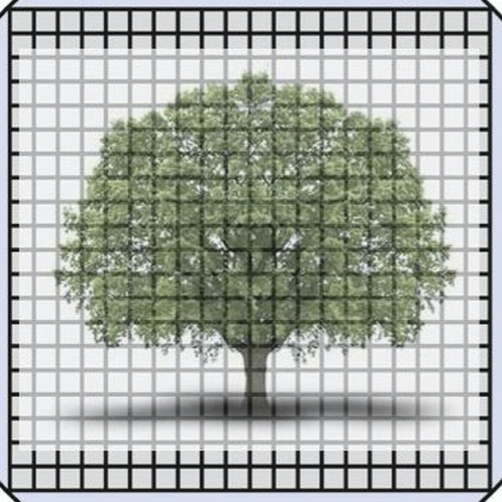
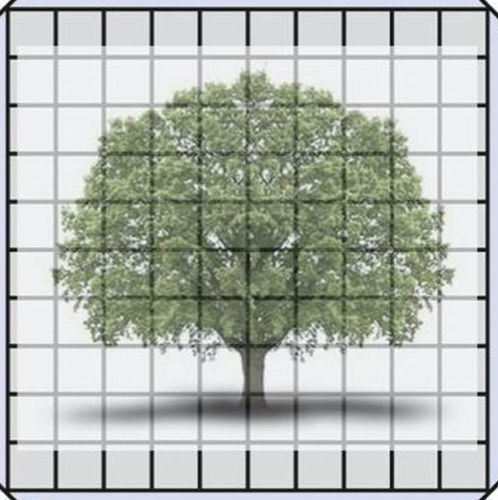
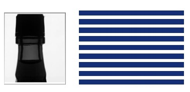
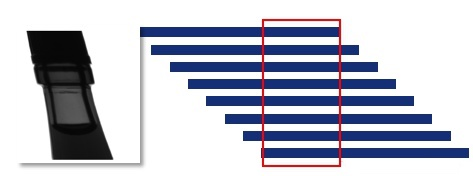
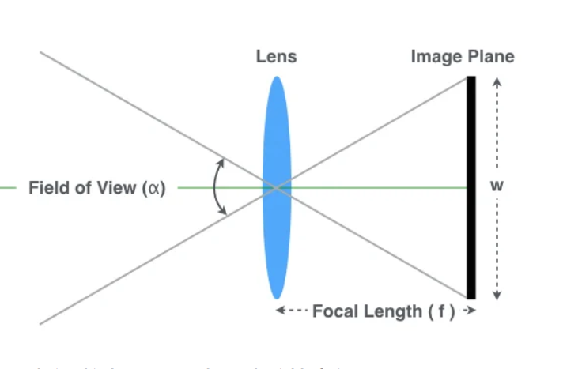
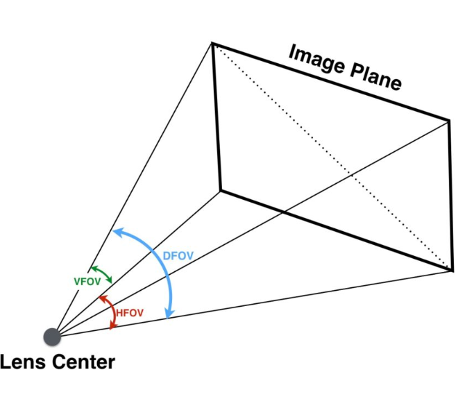
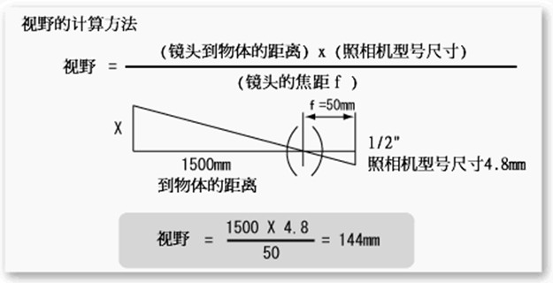
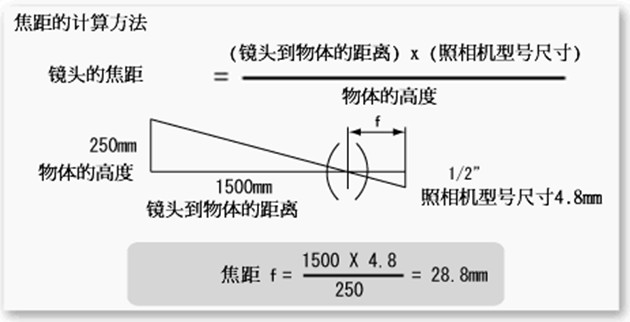
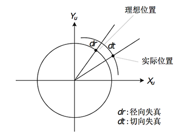

# RM 教程 4 —— 相机

>   机械是肉体， 电控是大脑， 视觉是灵魂


## 一、相机结构简介

广义的相机由两部分组成：

-   工业相机
-   镜头

### （1）工业相机

了解工业相机的相关参数能够帮助我们更好的理解相机功能，进而帮助我们完成对相机的选型工作。所谓外行看热闹，内行看门道，工业相机的门道就从其参数开始。

#### 1. 分辨率

相机的传感器 sensor 是有许多像素点按照矩阵的形式排列而成，分辨率就是以水平方向和垂直方向的像素来表示的。分辨率越高，成像后的图像像素数就越高，图像就越清晰。常用的工业面阵相机分辨率有 130 万、 200 万、 500 万等；对于线阵相机而言，分辨率就是传感器水平方向上的像素数，常见有 1 K、 2 K、 6 K等。

在相机分辨率的选型上，要根据我们的项目需求而定，并**不一定是分辨率越高就越好**，分辨率高带来的图像数据量就大，后期的算法处理复杂度就高，而且一般分辨率大的相机，帧率一般都不会太高。

#### 2. 传感器尺寸

传感器尺寸是以有效面积（宽x高）或以对角线大小（英寸）来表示的，常见的传感器尺寸如下：

| 型号 | 有效面积 宽x高（mm） |
| ---- | -------------------- |
| 1/4″ | 3.2mm×2.4mm          |
| 1/3″ | 4.8mm×3.6mm          |
| 1/2″ | 6.4mm×4.8mm          |
| 2/3″ | 8.8mm×6.6mm          |
| 1″   | 12.8mm×9.6mm         |

传感器尺寸越大，一定程度上表示相机可容纳像素个数越多，成像的画幅越大（并不一定是视野更大）。

#### 3. 像元尺寸

像元尺寸就是每个像素的面积。单个像素面积小，单位面积内的像素数量多，相机的分辨率增加，**利于对细小缺陷的检测和增大检测视场**。随着像素面积的缩小，满阱能力（每个像素能够储存的电荷数量）也随之减小，造成**相机动态范围的降低**。

<center class="half">
    
    
</center>

#### 4. 像素深度

像素深度是指每个像素用多少比特位表示。通常，每个像素的比特位数多，表达图像细节的能力强，这个像素的颜色值更加丰富、分的更细，颜色深度就更深。一般像素深度有1位、8位、16位、24位和32位。灰度显示就是 8 个二进制位， RGB 显示就是 24 个二进制位。

#### 5. 动态范围

动态范围是用来描述每个像素能够分辨出的灰度等级。它是饱和电压（最大的输出电平）相机输出的噪声之比。宽动态范围能够使场景中非常亮和非常昏暗部分的细节同时被清晰的显示。一般来说，低动态范围的相机噪声比较多，照片会缺失亮部细节和暗部细节。

#### 6. 最大帧率

最大帧率表示的是面阵工业相机每秒能够采集并输出的最大帧数，这往往和传感器芯片和数据输出接口带宽有关。根据项目需求，对于拍摄运动物体，建议选取高帧率相机，具体帧率数要根据拍摄精度来确定。

#### 7. 曝光方式

工业相机常见的曝光方式有帧曝光（global shutter）和行曝光（rolling shutter）。

帧曝光是指传感器阵列中所有像素同时曝光，曝光周期由预先设定的快门时间确定。这种曝光方式的相机适合拍摄运动物体，图像不会偏移，不会失真。



行曝光是指同一行上的像素同时曝光，不同行的曝光起始时间不同，每行的曝光时间是相同的，行间的延迟不变。这种曝光方式的相机适用于拍摄静止的物体，拍摄运动物体，图像会偏移。



在工业相机的选型中，一般参数表中会标注全局快门或卷帘快门，他们分别对应帧曝光和行曝光。

#### 8. 曝光时间

传感器将光信号转换为电信号形成一帧图像，每个像元接受光信号的过程叫曝光，所花费的时间叫曝光时间，也叫快门速度。

这个时间是整个算法处理性能的上限。

#### 9. 采集模式

采集模式分为了连续采集、外触发采集和软触发采集三种。

-   连续采集指相机进行连续曝光，输出实时图像。这是我们一般连接在电脑上使用相机的方式。
-   外触发采集是指当相机处于外触发模式后，相机处于待机模式，不曝光，只有当相机通过I/O口接收到相机规定的单个脉冲（方波）信号后，传感器曝光一次，部分相机支持信号的上升沿、下降沿和高低电平的触发。**这种方法也是我们比赛所使用的方式，这样的好处是通过固定频率的触发信号，使得相机的数据与陀螺仪的信号尽可能在同一时刻产生，使其数据对齐。**
-   软触发是指当相机处于外触发模式后，相机处于待机模式，不曝光，只有当相机软件发出指令后，传感器曝光一次。

#### 10. 增益

工业相机通常具有一个对传感器的信号进行放大的视频放大器，其放大倍数称为增益。增益越大，噪声就会变大，对传统图像处理越不利。但这也是减少曝光时间提高图像亮度的一种方式。


### （2）镜头

镜头是摄像机中的光学元件，直接影响成像质量的优劣。

分类：

-   按照焦距分类：焦距决定了相机适合观察什么距离的物体，短焦一般适合观察近距离物体，长焦一般适合观察远距离物体。

-   按照视角大小分类：

    -   广角：视角大，可观测范围广。**但同时会产生较大畸变。**

    -   标准：视角小，但产生的畸变也较小。下图是一个畸变的例子：

        

        一般来说，在没有特殊需求的情况下，镜头选型选择标准镜头。

-   光圈焦距调整方式

    -   固定光圈定焦镜头
    -   手动光圈定焦镜头
    -   自动光圈定焦镜头
    -   手动变焦镜头
    -   自动变焦镜头
    -   ……

在选择镜头时，一般是根据视野的大小确定焦距的。因此我们需要了解 FOV （视场角）。

FOV 的全称是 Field of View 。如下图，如果成像平面的宽度 W 固定， FOV 的大小直接由 Focal Length （焦距）决定。 Focal Length 越大，看得越远，但 FOV 越小。 Focal Length 越小，看得越近，但 FOV 变大。



如果已知 W 和 Focal Length ， FOV 可以用简单的三角函数关系就可以求出：
$$
\alpha = 2 \tan^{-1} \frac{w}{2f}
$$
FOV 有三种：

-   HFOV：由 Focal Length 和 senor 的宽度（W）决定
-   VFOV：由 Focal Length 和 sensor 的高度（H）决定
-   DFOV：由 Focal Length ， W ， H 共同决定



当我们选定了一个相机时，我们就知道了相机芯片的参数，为其配置镜头。

当我们选定了一个工业相机时，我们就已经知道它的感光芯片的参数，而我们需要为其配置一个合适的镜头，使得它的视野在我们的需求附近。视野过大，意味着图像中出现大量无关的目标，增加处理负担，同时也会导致目标所占的像素点降低，减少拍摄的特征；视野过小，那么没办法完整地记录目标，从而丧失处理的能力。

视野的计算方法比较简单，就是一个相似三角形计算。



同样，我们可以用类似的方法估计焦距大小，这也是相机标定的完成方式。




### （3）队内使用的相机

队内现在主要使用的相机型号为 MINDVISION 公司生产的 MV-SUA133GC 。

下面为组装好的摄像机图片：

<center class="half">
  
  
</center>


## 二、相机成像模型

相机成像的过程就是世界坐标系向像素坐标系转换的过程，即：世界坐标系(3d) -> 相机坐标系(3d) -> 像平面坐标系(2d) -> 像素坐标系(2d)，经过这样一级一级的转换之后，物体在空间中的坐标即转换为在图像中的像素坐标。

四个坐标系的表示如下：

-   世界坐标系 $X_w, Y_w, Z_w$
-   相机坐标系 $(X_c, Y_c, Z_c)$
-   像平面坐标系 $(x, y)$
-   像素坐标系 $(u, v)$

### 1）世界坐标系(3d) -> 相机坐标系(3d)

从世界坐标系到相机坐标系的转换是**刚体变换**，是**旋转动作和平移动作**的结果，如下所示：
$$
\begin{bmatrix}
X_c\\
Y_c\\
Z_c\\
1\\
\end{bmatrix}
=
\begin{bmatrix}
R&t\\
0&1\\
\end{bmatrix}
\begin{bmatrix}
X_w\\
Y_w\\
Z_w\\
1\\
\end{bmatrix}
$$
旋转矩阵R是正交矩阵，可通过罗德里格斯（Rodrigues）变换转换为只有三个独立变量的旋转向量：
$$
\left\{
\begin{array}{c}
\theta \leftarrow norm(r)\\
r \leftarrow r/\theta
\end{array}
\right .
\\
R = \cos(\theta)I + (1-\cos(\theta))rr^T + \sin(\theta) 
\begin{bmatrix}
0&-r_z&r_y\\
r_z&0&-r_x\\
-r_y&r_x&0\\
\end{bmatrix}
$$
因此，刚体变换可用 6 个参数来描述，这 6 个参数就称为**相机的外参**（Extrinsic），相机外参决定了空间点从世界坐标系转换到相机坐标系的变换，也可以说外参描述了相机在世界坐标系中的位置和朝向。

### 2）相机坐标系(3d) -> 像平面坐标系(2d)

相机坐标系到像平面坐标系的转换如下图所示：


根据相似三角形，点 P 在相机坐标系和像平面坐标系中的坐标满足如下关系：
$$
\left \{ 
\begin{array}{c}
\cfrac{x}{f} = \cfrac{X_c}{Z_c}\\
\cfrac{y}{f} = \cfrac{Y_c}{Z_c}\\
\end{array}
\right .
\Longrightarrow
\left \{ 
\begin{array}{c}
x = f \cfrac{X_c}{Z_c}\\
y = f \cfrac{Y_c}{Z_c}\\
\end{array}
\right .
$$

### 3）像平面坐标系(2d) -> 像素坐标系(2d)

图像坐标系坐标轴的单位通常为毫米（mm），原点是相机光轴与相面的交点（称为主点），即图像的中心点，轴、轴分别与轴、轴平行。故两个坐标系实际是平移关系，即可以通过平移就可得到。

 像素坐标是光在平面成像的一个模拟量，所以需要对成像平面上的像进行采样和量化，得到物体的像在像素平面上的坐标值。像素平面与成像平面之间，**相差一个缩放和原点的平移**。如下式所示，在 $u$ 轴上放大了 $\alpha$ 倍，在 $v$ 轴上放大 $\beta$ 倍，原点平移 $c_x$ ， $c_y$ 。
$$
\left \{
\begin{array}{c}
u = \alpha x + c_x\\
v = \beta y + c_y
\end{array}
\right .
$$
这里忽略了相机畸变的影响。

代入 $x, y$ 得到：
$$
\left \{
\begin{array}{c}
u = f_x \cfrac{x_c}{z_c} + c_x\\
v = f_y \cfrac{y_c}{z_c} + c_y\\
\end{array}
\right .
$$
整理成齐次形式：
$$
\begin{bmatrix}
u\\
v\\
1\\
\end{bmatrix}
=
\cfrac{1}{z_c}
\begin{bmatrix}
f_x&0&c_x\\
0&f_y&c_y\\
0&0&1\\
\end{bmatrix}
\begin{bmatrix}
x_c\\
y_c\\
z_c\\
\end{bmatrix}
$$
最终得到
$$
\begin{bmatrix}
u\\
v\\
1\\
\end{bmatrix}
=
\cfrac{1}{z_c}
\begin{bmatrix}
f_x&0&c_x\\
0&f_y&c_y\\
0&0&1\\
\end{bmatrix}
\begin{bmatrix}
1&0&0&0\\
0&1&0&0\\
0&0&1&0\\
\end{bmatrix}
\begin{bmatrix}
R&t\\
0&1\\
\end{bmatrix}
\begin{bmatrix}
X_w\\
Y_w\\
Z_w\\
1\\
\end{bmatrix}
$$
即世界坐标到像素坐标的转换过程。


## 三、相机畸变

理想的针孔成像模型确定的坐标变换关系均为线性的，而实际上，现实中使用的相机由于镜头中镜片因为光线的通过产生的不规则的折射，**镜头畸变**（lens distortion）总是存在的，即根据理想针孔成像模型计算出来的像点坐标与实际坐标存在偏差。畸变的引入使得成像模型中的几何变换关系变为非线性，增加了模型的复杂度，但更接近真实情形。畸变导致的成像失真可分为**径向失真**和**切向失真**两类：



畸变类型很多，总体上可分为径向畸变和切向畸变两类。

-   径向畸变的形成原因是镜头制造工艺不完美，使得镜头形状存在缺陷，包括枕形畸变和桶形畸变等，可以用如下表达式来描述：
    $$
    \left \{
    \begin{array}{c}
    x_0 = x (1 + k_1 r^2+ k_2r^4 + k_3 r^6 )\\
    y_0 = y (1 + k_1 r^2+ k_2r^4 + k_3 r^6 )\\
    \end{array}
    \right .
    $$

-   切向畸变又分为薄透镜畸变和离心畸变等，薄透镜畸变则是因为透镜存在一定的细微倾斜造成的；离心畸变的形成原因是镜头是由多个透镜组合而成的，而各个透镜的光轴不在同一条中心线上。切向畸变可以用如下数学表达式来描述：
    $$
    \left \{
    \begin{array}{c}
    x_0 = x + [2p_1y + p_2(r^2 + 2x^2)]\\
    y_0 = y + [2p_2x + p_1(r^2 + 2y^2)]\\
    \end{array}
    \right .
    $$

实际计算过程中，如果考虑太多高阶的畸变参数，会导致标定求解的不稳定。

在上述的径向畸变和切向畸变的数学模型中，我们一共使用了 $5$ 个参数描述畸变。它们分别是 $[k_1, k_2, k_3, p_1, p_2]$ 。它们被称为畸变参数。


注意：鱼眼畸变需要用专门的鱼眼模型。


对于相机坐标系中的一个点 $P(X, Y, Z)$ ，我们能够通过 $5$ 个畸变系数找到这个点在像素平面上的正确位置：

1.   将三维空间点投影到归一化图像平面。设它的归一化坐标为 $[x, y]^T$ 。

2.   对归一化平面上的点进行径向畸变和切向畸变纠正。给定归一化坐标，可以求出原始图像上的坐标。
     $$
     \left \{
     \begin{array}{c}
     x_{\text{distorted}} = x (1 + k_1 r^2+ k_2r^4 + k_3 r^6 ) + [2p_1y + p_2(r^2 + 2x^2)]\\
     y_{\text{distorted}} = y (1 + k_1 r^2+ k_2r^4 + k_3 r^6 ) + [2p_2x + p_1(r^2 + 2y^2)]\\
     \end{array}
     \right .
     $$

3.   将纠正后的点通过内参数矩阵投影到像素平面，得到该点在图像上的正确位置。
     $$
     \left \{
     \begin{array}{c}
     u = f_x x_{\text{distorted}} + c_x\\
     v = f_y y_{\text{distorted}} + c_y\\
     \end{array}
     \right .
     $$


## 四、相机标定

我们可以使用标定板辅助进行相机标定。这是一个非常贵重且易损坏的工具，**使用时一定要小心！**


### 1）相机标定的程序实现

#### 1. 寻找标定板角点

``OpenCV``提供了寻找标定板棋盘格角点的函数``findChessboardCorners()``，他的声明如下：
``bool cv::findChessboardCorners(InputArray image, Size patternSize, OutputArray corners, int flags = CALIB_CB_ADAPTIVE_THRESH+CALIB_CB_NORMALIZE_IMAGE)``
你只需在意前三个参数，他们分别意为：

* image
    输入的图像
* patternSize
    棋盘格的大小，例如这一棋盘格的大小为``(11, 8)``，要注意的是棋盘格的大小只考虑内侧的角点数
* corners
    输出结果，用向量的形式储存输出的角点

#### 2. 对找到的角点亚像素精化

``OpenCV``提供了函数``find4QuadCornerSubpix()``来实现对棋盘格角点的亚像素精化，他的声明如下：
``bool cv::find4QuadCornerSubpix(InputArray img, InputOutputArray corners, Size region_size)``。
它的功能为在给定的点的周围一定范围内以亚像素的精度逼近角点。
下面说明部分参数意义：

* corners
    * 需要逼近的角点的初始值
* region_size
    * 在region_size内寻找角点

利用find4QuadCornerSubpix函数可以更精确的找到角点，提高标定的精度。

#### 3. 相机标定

``OpenCV``提供了函数``calibrateCamera()``来实现相机标定的相关功能，他的声明如下

```
double cv::calibrateCamera(InputArrayOfArrays objectPoints,
					InputArrayOfArrays imagePoints,
					Size imageSize,
					InputOutputArray cameraMatrix,
					InputOutputArray distCoeffs,
					OutputArrayOfArrays rvecs,
					OutputArrayOfArrays tvecs,
					int flags = 0,
					TermCriteria criteria = TermCriteria(TermCriteria::COUNT+TermCriteria::EPS, 30, DBL_EPSILON) 
)	
```

下面说明他的参数的意义：

* `objectPoints`
    * 棋盘格上的角点对应的世界坐标系中的位置
* `imagePoints`
    * 棋盘格上找到的角点
* `imageSize`
    * 图片的大小
* `cameraMatrix`
    * 输出的相机内参矩阵
* `distCoeffs`
    * 输出的相机畸变矩阵
* `rvecs`
    * 相机坐标系与世界坐标系的旋转向量
* `tvecs`
    * 相机坐标系与世界坐标系的平移向量

#### 4. 程序

以下为程序的实现：

链接: _<https://pan.baidu.com/s/1I0PD_DWOrrHCjrLXzzAo_g>_ 提取码: 1ur9

```cpp
#include <iostream>
#include <opencv2/opencv.hpp>
#include <opencv2/core/core.hpp>

using namespace cv;

int main() {

    const int board_w = 11, board_h = 8;
    const int board_n = board_w * board_h;
    Size board_size( 11, 8 );

    Mat gray_img, drawn_img;
    std::vector< Point2f > point_pix_pos_buf;
    std::vector< std::vector<Point2f> > point_pix_pos;

    int found, successes = 0;
    Size img_size;

    int cnt = 0;
    int k = 0, n = 0;
    for (int i = 0; i < 20; i++){
        cv::Mat src0 = cv::imread(std::__cxx11::to_string(i).append(".jpg"));

        if ( !cnt ) {
            img_size.width = src0.cols;
            img_size.height = src0.rows;
        }
        found = findChessboardCorners( src0, board_size, point_pix_pos_buf );
        if ( found && point_pix_pos_buf.size() == board_n ) {
            successes++;
            cvtColor( src0, gray_img, COLOR_BGR2GRAY );
            find4QuadCornerSubpix( gray_img, point_pix_pos_buf, Size( 5, 5 ) );
            point_pix_pos.push_back( point_pix_pos_buf );
            drawn_img = src0.clone();
            drawChessboardCorners( drawn_img, board_size, point_pix_pos_buf, found );
            imshow( "corners", drawn_img );
            waitKey( 50 );
        } else
            std::cout << "\tbut failed to found all chess board corners in this image" << std::endl;
        point_pix_pos_buf.clear();
        cnt++;

    };
    std::cout << successes << " useful chess boards" << std::endl;

    Size square_size( 10, 10 );
    std::vector< std::vector< Point3f > > point_grid_pos;
    std::vector< Point3f > point_grid_pos_buf;
    std::vector< int > point_count;

    Mat camera_matrix( 3, 3, CV_32FC1, Scalar::all( 0 ) );
    Mat dist_coeffs( 1, 5, CV_32FC1, Scalar::all( 0 ) );
    std::vector< Mat > rvecs;
    std::vector< Mat > tvecs;

    for (int i = 0; i < successes; i++ ) {
        for (int j = 0; j < board_h; j++ ) {
            for (int k = 0; k < board_w; k++ ){
                Point3f pt;
                pt.x = k * square_size.width;
                pt.y = j * square_size.height;
                pt.z = 0;
                point_grid_pos_buf.push_back( pt );
            }
        }
        point_grid_pos.push_back( point_grid_pos_buf );
        point_grid_pos_buf.clear();
        point_count.push_back( board_h * board_w );
    }

    std::cout << calibrateCamera( point_grid_pos, point_pix_pos, img_size, camera_matrix, dist_coeffs, rvecs, tvecs ) << std::endl;
    std::cout << camera_matrix << std::endl << dist_coeffs << std::endl;
    return 0;
}
```


如果想要将畸变的图像还原为原图，可以使用函数``cvUndistort2( ImageC1, Show1, &intrinsic_matrix, &distortion_coeffs);``来进行图像矫正。


## 五、作业

请你自己编写一个相机标定程序，对下压缩包内的两个相机进行标定，分别给出标定的结果（重投影误差，相机内参矩阵，畸变矩阵）。**不要复制粘贴！**

链接: _<https://pan.baidu.com/s/1yzcor8vEUOs2CmfF6BVGRw>_ 提取码: 01b4


## 六、参考教程

1.   [浅析相机FOV](https://blog.csdn.net/huangkangying/article/details/108393392)
2.   [工业相机常见参数](https://zhuanlan.zhihu.com/p/119449860)
3.   [相机成像模型](https://blog.csdn.net/u014493244/article/details/80882060)
4.   [相机的那些事儿 (二)成像模型](https://zhuanlan.zhihu.com/p/23090593)


---

第一作者：Harry-hhj，Github主页：[传送门](https://github.com/Harry-hhj)

第二作者：E-T-E-R-N-A-L-B-L-U-E，[传送门](https://github.com/E-T-E-R-N-A-L-B-L-U-E)

