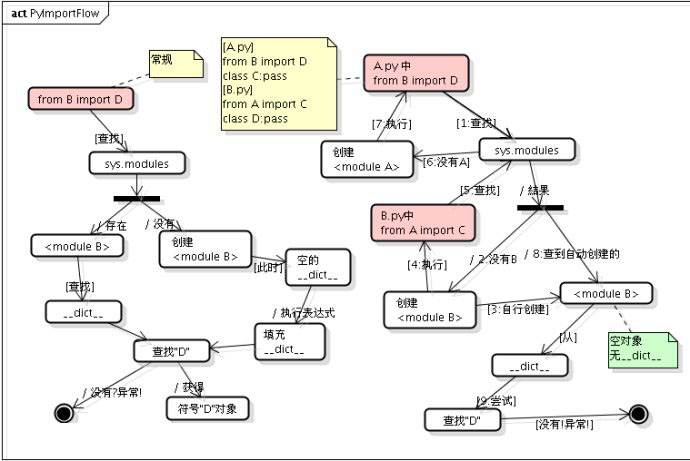
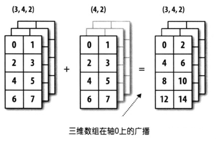
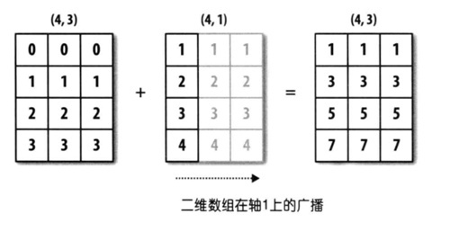
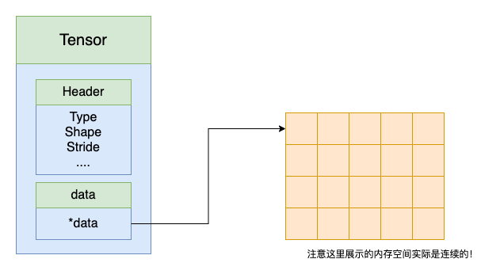
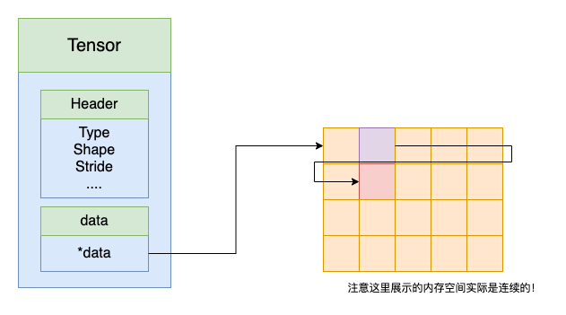
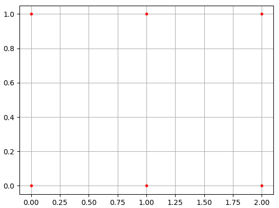

# 神经网络集训 —— Numpy 的使用

在讲解具体的知识点之前，先来做做以下的问卷，进行一个基础的自查。这样，既能避免过分地自信导致学习态度的降低，也能有针对性地学习自己不理解的知识。当然，**做题时请不要借助外部资料！**

链接: _<https://pan.baidu.com/s/1Ip4Dz6sAel3htlETxWbOYg>_ 提取码: op3f


## 一、Python 基础

### （1）import 机制

对于 Python 脚本， `import` 的顺序不同，运行脚本不同，程序执行的代码可能不同，结果自然也不会相同。

我们来看以下三个脚本：

`A.py` ：

```python
# A.py
x=1
def func(val):
    print(val)
    return x + val
x = func(4)
```

`B.py` ：

```python
# B.py
def func(val):
    print(val)
func(1)

import A
A.func(2)
```

`C.py` ：

```python
# C.py
import A
A.x = 10

import B
B.func(2)
print(A.x)
```

那么 `C.py` 的运行结果是：

```text
4
1
2
2
10
```

为什么最后是 10 而不是 5 ？原因在于 python 的 import 机制。

#### 1）标准 import

Python 中所有加载到内存的模块都放在 `sys.modules` 。当 `import` 一个模块时首先会在这个列表中查找是否已经加载了此模块，如果加载了则只是将模块的名字加入到正在调用 `import` 的模块的 Local 名字空间中。如果没有加载则从 `sys.path` 目录中按照模块名称查找模块文件，模块可以是 `py` 、 `pyc` 、 `pyd` ，找到后将模块载入内存，并加到 `sys.modules` 中，并将名称导入到当前的 Local 名字空间。

**一个模块不会重复载入。**多个不同的模块都可以用 `import` 引入同一个模块到自己的 Local 名字空间，其实背后的 `PyModuleObject` 对象只有一个。这里说一个容易忽略的问题： `import` 只能导入模块，不能导入模块中的对象（类、函数、变量等）。例如：模块 `A`（`A.py`）中有个函数 `getName` ，另一个模块不能通过 `import A.getName` 将 `getName` 导入到本模块，只能用 `from A import getName` 。

注意，虽然有一种写法 `from A import *` 可以一次性导入模块中的所有对象，但是我们无法确保所有模块的对象不重名，可能会造成内存覆盖的问题，这在项目中非常难 debug ，所以**不要使用**！

#### 2）嵌套 import

##### 1. 顺序嵌套

例如：本模块导入 `A` 模块（`import A`）， `A` 中又 `import B` ， `B` 模块又可以 `import C` ……

这中嵌套比较容易理解，需要注意的一点就是**各个模块的 Local 名字空间是独立的**。对于上面的例子，本模块 `import A` 之后本模块只能访问模块 `A` ，不能访问模块 `B` 及其他模块。虽然模块 `B` 已经加载到内存了，如果访问还要再明确的在本模块中 `import B` 。

##### 2. 循环嵌套

举个例子：

```python
# A.py
from B import D
class C: pass
```

```python
# B.py
from A import C
class D: pass
```

结果会报错 `ImportError: cannot import name 'D' from partially initialized module 'B' (most likely due to a circular import)` 。如果将 `A.py` 改为： `import B` 就可以了。为什么？

这跟 Python 内部 `import` 的机制是有关的，具体到 `from B import D` ， Python 内部会分成几个步骤：

1.   在 `sys.modules` 中查找符号 `“B”`
2.   如果符号 `B` 存在，则获得符号 `B` 对应的 `module` 对象。从 <modult B> 的 `__dict__` 中获得符号 `“D”` 对应的对象，如果 `“D”` 不存在，则抛出异常。
3.   如果符号 `B` 不存在，则创建一个新的 `module` 对象 `<module B>`，注意，此时， `module` 对象的 `__dict__` 为空。执行 `B.py` 中的表达式，填充 `<module B>` 的 `__dict__` 。从 `<module B>` 的 `__dict__` 中获得 `“D”` 对应的对象，如果 `“D”` 不存在，则抛出异常。

所以这个例子的执行顺序如下：

1.   执行 `A.py` 中的 `from B import D` 由于是执行的 `python A.py` ，所以在 `sys.modules` 中并没有 `<module B>` 存在， 首先为 `B.py` 创建一个 `module` 对象 (`<module B>`) ， 注意，这时创建的这个 `module` 对象是空的，里边啥也没有，在 Python 内部创建了这个 `module` 对象之后，就会解析执行 `B.py` ，其目的是填充 `<module B>` 这个 `__dict__` 。 

2.   执行 `B.py` 中的 `from A import C` 在执行 `B.py` 的过程中，会碰到这一句， 首先检查 `sys.modules` 这个 `module` 缓存中是否已经存在 `<module A>` 了， 由于这时缓存还没有缓存 `<module A>` ， 所以类似的，Python 内部会为 `A.py` 创建一个 module 对象(`<module A>`)， 然后，同样地，执行 `A.py` 中的语句。

3.   再次执行 `A.py` 中的 `from B import D` 这时，由于在第 1 步时，创建的 `<module B>` 对象已经缓存在了 `sys.modules` 中， 所以直接就得到了 `<module B>` ， 但是，注意，从整个过程来看，我们知道，这时 `<module B>` 还是一个空的对象，里面啥也没有， 所以从这个 `module` 中获得符号 `"D"` 的操作就会抛出异常。 如果这里只是 `import B` ，由于 `"B"` 这个符号在 `sys.modules` 中已经存在，所以是不会抛出异常的。

     

##### 3）包 import

只要一个文件夹下面有个 `__init__.py` 文件，那么这个文件夹就可以看做是一个包。包导入的过程和模块的基本一致，只是导入包的时候会执行此包目录下的 `__init__.py` 而不是模块里面的语句了。另外，如果只是单纯的导入包，而**包的 `__init__.py` 中又没有明确的其他初始化操作，那么此包下面的模块是不会自动导入的。**

例如

有下面的包结构：

```shell
PA
|---- __init__.py
|---- wave.py
|---- PB1
      |---- __init__.py
      |---- pb1_m.py
|---- PB2
      |---- __init__.py
      |---- pb2_m.py
```

有如下程序：

```python
import sys
import PA.wave						 #1
import PA.PB1							 #2
import PA.PB1.pb1_m as m1		 #3
import PA.PB2.pb2_m					#4
PA.wave.getName()					  #5
m1.getName()							 #6
PA.PB.pb2_m.getName()				#7
```

程序执行过程如下：

1.   当执行 `#1` 后， `sys.modules` 会同时存在 `PA` 、 `PA.wave` 两个模块，此时可以调用 `PA.wave` 的任何类或函数了。不能调用 `PA.PB1(2)` 下的任何模块。当前 `Local` 中有了 `PA` 名字。
2.   当执行 `#2` 后，只是将 `PA.PB1` 载入内存， `sys.modules` 中会有 `PA` 、 `PA.wave` 、 `PA.PB1` 三个模块，但是 `PA.PB1` 下的任何模块都没有自动载入内存，此时如果直接执行 `PA.PB1.pb1_m.getName()` 则会出错，因为 `PA.PB1` 中并没有 `pb1_m` 。当前 `Local` 中还是只有 `PA` 名字，并没有 `PA.PB1` 名字。
3.   当执行 `#3` 后，会将 `PA.PB1` 下的 `pb1_m` 载入内存， `sys.modules` 中会有 `PA` 、 `PA.wave` 、 `PA.PB1` 、 `PA.PB1.pb1_m` 四个模块，此时可以执行 `PA.PB1.pb1_m.getName()` 了。由于使用了 `as` ，当前 Local 中除了 `PA` 名字，另外添加了 `m1` 作为 `PA.PB1.pb1_m` 的别名。
4.   当执行 `#4` 后，会将 `PA.PB2` 、 `PA.PB2.pb2_m` 载入内存， `sys.modules` 中会有 `PA` 、 `PA.wave` 、 `PA.PB1` 、 `PA.PB1.pb1_m` 、 `PA.PB2` 、 `PA.PB2.pb2_m` 六个模块。当前 `Local` 中还是只有 `PA` 、 `m1` 。
5.   下面的 `#5` ， `#6` ， `#7` 都是可以正确运行的。

注意的是：如果 `PA.PB2.pb2_m` 想导入 `PA.PB1.pb1_m` 、 `PA.wave` 是可以直接成功的。最好是采用明确的导入路径，对于` ./..` 相对导入路径还是不推荐用。

### （2）避免使用全局表达式

一个模块中定义的全局变量一般是可以被其他模块所修改的，比如之前的例子中，模块 `B` 相信 `A.x` 值是 `1` ，但是它不知道在 `C.py` 中已经对它进行了修改。**这些修改直接修改变量值的操作都应该放在 `if __name__ == '__mian__':` 中。**

`if __name__ == '__mian__':` 是指在终端运行该 python 脚本时才会执行的语句，除此之外的所有情况下这些代码都不会执行。

### （3）变量含义

在 Python 中**所有的变量名都是一个符号**，其实现是**将变量名和它的值绑定**。 **`=` 号并不代表赋值，而是重新将一个变量名与新的值进行绑定。**有了这个理解，你就会对下面的示例有更好地理解：

```python
def func1(a):
    a = "world"
def func2(a):
    a[0] = "world"

x = "hello"
func1(x)
print(x)

x = ["hello"]
func2(x)
print(x)
```

在 `func1` 中，调用时先将 `x` 的值同时绑定到参数 `a` 上，然后将 `a` 重新绑定到常量 `“world”` 上，这并不影响 `x` 绑定在 `"hello"` 上。

而在 `func2` 中，调用时先将 `x` 的值（数组）同时绑定到参数 `a` 上，然后将这个数组的第 0 个数据指向常量 `“world”` 上，这时 `x` 绑定的值也发生了变化。

如果你有 C/C++ 基础，你可以把所有变量符号想象成一个指针， `=` 的右操作数就是指针要指向的对象，而 `=` 就是对指针赋值的过程。

### （4）原地运算

在 Python 中，一些运算是返回备份的，而另一些是直接修改原值的，叫做原地运算。这些运算很多，不可能一一枚举，但我们需要有这样一个概念。

例如下面的函数：

```python
def minus_one(minuend):
  minuend -= 1
```

如果你没有办法区分这个函数是否可以直接修改调用时传入的参数值，那么**我们推荐将所有函数写成 `return` 的形式返回运算结果**。

```python
def minus_one(minuend):
  return minuend - 1

x = 10
x = minus_one(x)
```


## 二、Numpy 基础

### （0）广播 （broadcasting）

在讲解 Numpy 运算之前，我们先要讲一个非常有用的机制——广播（broadcasting），它能自动将两个大小不等的张量通过**复制扩展**自动变成两个相同大小的张量然后进行运算。尽管它非常有用，但是它也是程序没有报错却也运行结果不对的杀手！（因为程序不会报错，因此你可以使用 `assert` 确保程序符合你的想法）

广播用于对应元素的二元运算，如`+-*/`等。对应元素的二元运算一般要求两个张量的shape相同，当shape不同时，会触发广播。

广播的原则：**如果两个数组的后缘维度（trailing dimension，即从末尾开始算起的维度）的轴长度相符，或其中的一方的长度为 1 ，则认为它们是广播兼容的。**

#### 1. 后缘维度的轴长相符

```python
import numpy as np
x = np.array([[0, 0, 0],[1, 1, 1],[2, 2, 2], [3, 3, 3]])  
y = np.array([1, 2, 3])    
print(x + y)
```

上例中 x 的shape为 $(4, 3)$ ，y 的shape 为 $(3, )$ 。虽然前者是一维的，后者是二维的，但是比较后缘维度可知：

```python
(4,3)
   ^
  (3, )
   ^
```

它们的后缘维度相等， x 的第二维长度为 3 ，和 y 的维度相同。因此他们可以通过广播机制完成相加，在这个例子当中是将 y 沿着 0 轴进行扩展。


同样，下图也是可以的。



#### 2. 后缘维度不全相同，有一方长度为1

```python
import numpy as np
x = np.array([[0, 0, 0],[1, 1, 1],[2, 2, 2], [3, 3, 3]]) 
y = np.array([[1],[2],[3],[4]])   
print(x + y)
```

虽然 x 的 shape 为 $(4, 3)$ ， y 的 shape 为 $(4, 1)$ ，但第二个数组在 1 维轴上长度为 1 ，所以可以在 1 轴上进行广播。

```python
(4,3)
 ^ ^
(4,1)
 ^ ^
```



反例：

```python
import numpy as np
x = np.ones((4,3,5))
y = np.ones((4,1,3))
print(x + y)
```

代码会报错无法计算，因为从后缘维度数起 2 轴上 x 、 y 大小即不相同也不为 1 。


<br/>

Numpy 中表示张量的数据类型是 `ndarray` 。我们先介绍 `ndarray` 对象的基本概念，理解这些概念对你以后了解张量运算和实现有非常大的帮助！

### （1）张量整体的属性

一个张量是由一个数据头和一个数据块指针组成的。数据头中存放了张量的属性值，包括数据类型、数组形状和每个维度的 `stride` 。数据块指针指向的是张量的数据值，**对应内存中的一块连续的内存空间**。



数据类型很容易理解，比如 `int` 、 `float` 、 `bool` ，这些值**代表了多少个内存单元表示一个数据**，例如 `int` 表示一个数据占用 4 个字节。

**数组形状表示张量的形状大小，它指定了张量的各个维度**，例如 $(3,4,5)$ 表示一个 $3\times4\times5$ 的张量。我们规定：张量的最后一维称为低维，在低维上数据的内存分布是连续的，而第一个维称为高维。例如上面的例子中最高维是 $3$ 维，最低维是 $5$ 维。

每个维度的 stride 是为了方便数据的索引、存放和运算。 **stride 表示在每一个维度上加一时需要越过多少个数据。**它是通过公式计算得出的，你很快会发现计算过程非常简单。例如，对于 shape 等于 $(3, 4, 5)$ ，那么 stride 等于 $(20, 5, 1)$。记得，最低维的数据是连续的，所以最低维索引加一意味着只要前进一个数据就能得到下一个数据，对于更高维，索引加一意味着需要越过比它维度低的所有数据，也就是比它低维的乘积。下面有个直观的示例，在上图中，紫色数据块第 0 维索引加一，对应红色数据块，此时它需要越过第 0 维大小的数据块个数 5 。



**之后你也会发现通过改变张量的 shape 和 stride 可以直接实现运算而不需要改变数据内存块！**


#### （2）张量中元素的属性

一个元素的属性包括

-   元素值
-   元素坐标

想象一下，对于转置，我们不需要改变数据块，只需要把每个元素的坐标颠倒一下就可以了。


#### （3）张量运算

张量有三种运算的方式：

-   返回 `view` ，即返回的是数据本身，修改返回值将导致原变量的值发生变化
-   返回 `copy` ，即返回的数据的拷贝，后续操作与原变量无关
-   原地运算，即直接修改数据本身，无返回值


## 三、Numpy 运算

下面举的例子都建议你手动在命令行输一遍，我们也提供了 ipynb 教程：链接: https://pan.baidu.com/s/1MOTfMB7XB2eQ-aEwS4z8_g 提取码: twd3。


### （1） `ndarray` 对象的创建

`np.array()` ：从 python 列表创建，显式指定每个元素的值。

`np.empty()` ：只指定形状，不指定值。**元素值随机。**

`np.zeros()` ：只指定形状。元素值全 0 。

`np.ones()` ：只指定形状。元素值全 1 。

`np.eye()` ：创建**二维**张量，对角线为 1 ，其余为 0 。

`np.random.randn()` ：只指定形状，**非元组**。元素值标准正态分布。

`np.random.uniform()` ：指定形状和上下限。元素值均匀分布。**闭区间。**

`np.random.randint()` ：指定形状和上下限。元素值均匀分布，但只会取整数。前闭后开。

`np.arange()` ：创建一维张量。指定起点终点步长，类似 `range` 。前闭后开。

`np.linspace()` ：创建一维等差数列。指定起点终点数量。**闭区间。**

`np.concatenate()` ：在某个维度上拼接若干个张量。维度数不变。返回 `copy` 。**除了拼接的维度外要求其它维度大小相等。**特殊： `torch.cat` 。

-   可以想象成对于索引进行分类讨论，在一些时候选择某一个张量选择值

`np.stack()` ：在某个维度上堆叠若干个张量。维度数增加。返回 `copy` 。**要求所有维度大小相等。**

-   除了第 0 维堆叠不破坏内存连续性外，其他都会破坏。

`np.meshgrid()`：创建网格张量，返回两个张量，分别代表网格的 x 轴和 y 轴。

1. 坐标矩阵其实有大量的重复—— $X$ 的每一行都一样， $Y$ 的每一列都一样。基于这种强烈的规律性， numpy 提供的 `numpy.meshgrid()` 函数可以让我们快速生成坐标矩阵 $X$ ，$Y$ 。

2. 举例：

    ```python
    x, y = np.meshgrid(np.array([0,1,2]), np.array([0,1]))
    print(x)
    # [[0,1,2],
    #  [0,1,2]]
    print(y)
    # [[0,0,0],
    #  [1,1,1]]
    ```

    


#### （2） `ndarray` 对象的常用操作

`shape` ：获取当前张量的维度信息（维数以及每一维的长度）。

`reshape()` ：返回更改维度后的 `view` 。

-   更改的方式是**不破坏内存连续性**，只要各维度大小的乘积与原来各维度大小的乘积相等即可。因此，可以想象只需要强行改变 shape ，然后根据 shape 重新计算 stride，就能实现这一功能。例如， `shape=(3,4,5)` ， `stride=(20, 5, 1)` 经过 `reshape(15, 4)` 后 `shape=(15, 4)` ， `stride=(4, 1)` ，原数据块不用改变。

`resize()` ：更改自己的维度，无返回值。

-   **不破坏内存连续性**

`transpose()` ：返回更改维度顺序后的 `view` 。返回值内存不连续，但内存地址不变。特殊： `torch.permute` 。

-   这个操作通过改变shape 、 stride 即可实现。例如 `shape=(3, 4, 5)` ， `stride=(20, 5, 1)` 经过 `transpose(2, 0, 1)` 后变成 `shape=(5, 3, 4)` ， `stride=(1, 20, 5)` 。**即对 `stride` 也进行相同的 transpose ，而不是根据公式重新计算！**

`T` ： `transpose() ` 的特殊情况，针对**二维张量**，返回 `view` 。

`squeeze()` ：删除长度为 1 的维度，返回 `view` 。特殊： `torch.unsqueeze()` ：添加某个长度为 1 的维度，返回 `view` 。

`view()` ：提供对内存区域不同的切割方式，来完成数据类型的转换，而无须要对数据进行额外的copy，来节约内存空间，返回 `view` 。转换的数据内存必须是连续分布的。特殊： `torch.view` 。

`repeat()` ：将某个维度复制 n 次，每个元素复制（因此在某个维度上复制出的数据是聚在一起的），返回 `copy` 。特殊： `torch.repeat` 。特殊： `torch.expand` 。

`tile()` ：相当于多个张量 `concatenate()` 在一起，但可以同时复制多个维度。

`copy()` ：返回自身的 `copy` 。特殊： `torch.clone()` 。

`astype()` ：更改元素数据类型，返回 `copy` 。


#### （3） `ndarray` 对象的索引（维度索引和整体索引）

切片索引：一次只能索引一个维度。返回 `view` 。支持原地修改。

-   一个索引结构如下： `[start:end:step]` ，其中区间是左闭右开， `step` 表示一次跳过多少。这三个参数都可以参略，当 `start` 省略时，默认从第一个开始，即 `0` ，当 `end` 省略时，默认从直到最后一个（包括），当 `step` 省略时，默认步长为 `1` 。第一个 `:` 不能参略。注意对于大小 `(3, 4, 5)` ，索引 `[:, :4, :]` 和  `[:, :, :]` 不同。

坐标（列表）索引：一次只能索引一个维度。返回 `copy` 。支持原地修改。

-   举例，对一个 $3\times3\times3$ 的张量，在第二维度进行索引，并按照 `[2, 0]` 的顺序返回结果。

布尔索引：一次索引整个张量。返回 `copy` 。支持原地修改。

-   用一个相同大小的 `bool_` 型张量， `1` 表示保留该值， `0` 表示舍弃该值。返回一维张量，按照数据在内存中的排列顺序排列。

区域索引：利用 `np.ix_` ，产生笛卡尔积的映射关系。返回 `copy` 。支持原地修改。

-   举例，`[np.ix_([0,2], [2, 1])]` 提取的元素分别是 `(0, 2), (0, 1), (2, 2), (2, 1)` ，组成一个 $2\times2$ 的张量。


#### （4） `ndarray` 对象的运算

`max()` ， `min()` ， `mean()` ：在某个维度/整个张量上计算最大值，最小值，平均值。

`argmax()` ， `argmin()` ：在某个维度上计算最大值坐标，最小值坐标。

`+-*/` ：对应元素计算。注意 `*` 表示对应元素相乘，因此两个输入张量大小必须相等。

`dot()` 和 `@` ：针对二维张量，矩阵乘法。

指数对数三角函数等：每个元素计算。

大于小于等于比较运算：每个元素计算。返回布尔张量。

`floor()` ， `ceil()` ， `round()` ：向下取整，向上取整，四舍五入。

`where()` ：输入一个布尔张量和两个同形状的其他张量，根据布尔值选择两个张量中的值。即对于每个坐标，如果对应布尔值为 1 ，则选择第一个张量对应位置的值，否则选择第二个张量对应位置的值。


#### （5）`np.linalg` 线性代数相关运算

`np.linalg.det()` ：求二维矩阵的行列式，输入多维时以最低两维对高维分别进行计算

`np.linalg.inv()` ：求逆

`np.linalg.eig()` ：求特征值特征向量

`np.linalg.norm()` ：求范数

-   范数是具有“长度”概念的函数。

-   L0 范数：向量中非 0 的元素的个数。( L0 范数很难优化求解)
-   L1 范数：向量中各个元素绝对值之和。L1 会趋向于产生少量的特征，而其他的特征都是 0 。
-   L2 范数：向量各元素的平方和然后求平方根。可以防止过拟合，提升模型的泛化能力。L2 会选择更多的特征，这些特征都会接近于 0 。


#### （6）文件 io

`np.save` 和 `np.load` ：用于保存和加载一个 `ndarray` 张量

`np.savetxt` 和 `np.loadtxt` ：以 txt 格式保存和加载一个**二维** `ndarray` 张量，可以指定分隔符

`np.savez` 和 `np.load` ：用于同时保存多个 `ndarray` 张量，输入字典键值对，读取出一个字典


## 四、可视化

Matlab 是一个常用的数据分析和绘图软件，在 Python 我们也可以使用 `matplotlib` 库绘制图形。在进行可视化时，我们使用的是 `matplotlib.pyplot` 子库。

1. `plt.plot()` ：绘制折线图
2. `plt.scatter()` ：绘制散点图
3. `plt.bar()` ：绘制柱形图
4. `plt.hist()` ：绘制柱形图的频率分布
5. `plt.imshow()` ：绘制图像（RGB 格式，与 OpenCV 的 BGR 不同）
6. `plt.matshow()` ：可视化数组（热力图）
7. `plt.savefig()` ：保存最新绘制的一幅图，在 `plt.show()` 之前调用 `plt.savefig()` ；否则保存出去会是白纸一张。
8. `plt.show()` ：显示绘制好的图像
9. `plt.imsave()` ：保存绘制好的图像
10. `seaborn` 库，对 `matplotlib` 的二次封装，提供更美观的可视化。


<br/>

注意点：形状是参数列表（参数类型）还是以元组/列表（数据类型）表示、区间开闭、运算方式。


<br/>

讲了这么多，一定记住一点：**在神经网络中，如果有可能不是用 for 循环，就不要使用 for 循环！**


## 五、课后作业

为了巩固我们刚才讲解的知识，提升代码的实战能力，请完成以下课后作业 Quiz ，我们提供了参考答案，但这并不是唯一的正确答案。在下面的链接中还有一道较难的机器视觉实战题，我们并不是为了考察机器视觉，所以给出了计算方式，请用 Numpy 运算实现。

百度网盘链接: _<https://pan.baidu.com/s/1OHNeqrErD8zIaBiRyR0lUw>_ 提取码: 60kf


## 六、参考教程

1.   [Python 被导入模块多次被加载的问题（基于python的import机制）](https://blog.csdn.net/longzhiwen888/article/details/46604265)
2.   [Numpy学习——广播机制理解](https://zhuanlan.zhihu.com/p/402163854)


---

作者：Harry-hhj，Github主页：[传送门](https://github.com/Harry-hhj)

讲师：xinyang，Github主页：[传送门](https://github.com/xinyang-go)

