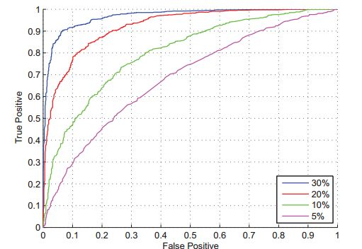
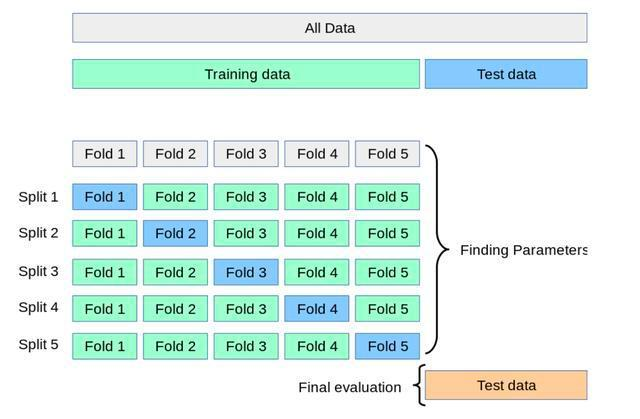
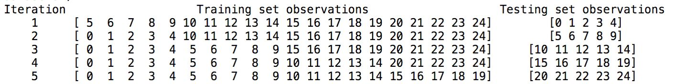
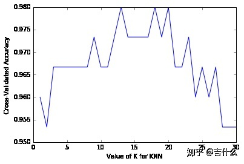

# ML 中的常用指标

目录：

-   [分类评估](#分类评估)（ [`TP`](#TP) 、 [`FP`](#FP) 、 [`TN`](#TN) 、 [`FN`](#FN) 、 [`Precision`](#Precision) 、 [`Recall`](#Recall) 、 [`F-score`](#F-score) 、 [`TPR`](#TPR) 、 [`FPR`](#FPR) 、 [`TNR`](#TNR) 、 [`FNR`](#FNR) 、 [`ROC`](#ROC) 、 [`AUC`](#AUC) 、 [`Accuracy`](#Accuracy) ）
-   [k 折交叉验证](#k-fold cross-validation)（ `k-fold cross-validation` ）


## 一、<span id="分类评估">分类评估</span>

<span id="TP">TP</span>（True Positive）：预测结果为正类，实际上就是正类

<span id="FP">FP</span>（False Positive）：预测结果为正类，实际上是反类

<span id="FN">FN</span>（False negative）：预测结果为反类，实际上是正类

<span id="TN">TN</span>（True negative）：预测结果为反类，实际上就是反类

### Precision、Recall、F-score

<span id="Precision">Precision</span>（精确度）可以理解为**预测结果为正类中有多少真实结果是正类的**：
$$
Precision = \cfrac{TP}{TP+FP}
$$
<span id="Recall">Recall</span>（召回率）可以理解为**真实结果为正类中有多少被预测成正类**：
$$
Recall = \cfrac{TP}{TP+FN}
$$
<span id="F-score">F-score</span>（F 值）又称作 `F1-measure` ，是**综合考虑 Precision 和 Recall 的指标**：
$$
F-score = 2 * \cfrac{Precision*Recall}{Precision+Recall}
$$

### TPR、FPR、TNR、FNR

<span id="TPR">TPR</span>（True Positive Rate）可以理解为所有正类中，有多少被预测成正类（**正类预测正确**），即召回率：
$$
TPR = \cfrac{TP}{TP+FN}
$$
<span id="FPR">FPR</span>（False Positive Rate）可以理解为所有反类中，有多少被预测成正类（**正类预测错误**）：
$$
FPR = \cfrac{FP}{FP+TN}
$$
<span id="TNR">TNR</span>（True Negative Rate）可以理解为所有反类中，有多少被预测成反类（**反类预测正确**）：
$$
TNR = \cfrac{TN}{FP+TN}
$$
<span id="FNR">FNR</span>（False Negative Rate）可以理解为所有正类中，有多少被预测成反类（**反类预测错误**）：
$$
FNR = \cfrac{FN}{TP+TN}
$$
<span id="ROC">ROC</span> ，以 FPR 为横坐标， TPR 为纵坐标，称作 ROC 曲线：



ROC 曲线又称作“受试者工作特性曲线”，很明显，越靠近左上角的点，效果越好。

<span id="AUC">AUC</span>（Area Under Curve）定义为 **ROC曲线下的面积** ，很明显，这个值越大越好。

-   如何绘制 ROC 曲线？

    

    ```python
    # -*- coding: utf-8 -*-
    import numpy as np
     
    ############计算ROC需要的库函数#############
    from sklearn.model_selection import cross_validate
    from sklearn import metrics
    from sklearn import svm
    import matplotlib.pyplot as plt
     
     
    #############计算fpr,tpr##################
    ##y是一个一维数组（样本的真实分类），数组值表示类别（一共有两类，1和2），人工标注，属于测试集的真实分类
    ##score即各个样本属于正例的概率；是网络的输出；首先用训练集训练网络，然后利用测试集的数据产生的
    ##fpr, tpr是ROC的横纵坐标
    ##thresholds是截断阈值
    y = np.array([1, 1, 2, 2])
    scores = np.array([0.1, 0.4, 0.35, 0.8])
    fpr, tpr, thresholds = metrics.roc_curve(y, scores, pos_label=2)
     
     
    #############画图##################
    plt.title('ROC')
    plt.xlabel('False Positive Rate')
    plt.ylabel('True Positive Rate')
    plt.plot(fpr, tpr,'--*b',label="tuli")
    plt.legend()
    plt.show()
    ```

    

### Accuracy

<span id="Accuracy">Accuracy</span>（准确率）可以理解为**所有实验中，分类正确的个数**：
$$
Accuracy = \cfrac{TP+TN}{TP+FP+TN+FN}
$$

## 二、<span id="k-fold cross-validation"> k 折交叉验证</span>

将原始数据集划分为训练集/测试集，是为了避免追求高准确率而在训练集上产生过拟合，从而使得模型在样本外的数据上也能得到高的准确率。**但是，划分出训练集/测试集的不同会使得模型的准确率产生明显的变化。**为了消除这一变化因素，我们可以创建一系列训练集/测试集，计算模型在每个测试集上的准确率，然后计算平均值。这就是 **K-fold cross-validation** 的本质**。**

K-fold cross-validation的步骤：

1.   将原始数据集划分为相等的K部分（“折”）
2.   将第 1 部分作为测试集，其余作为训练集
3.   训练模型，计算模型在测试集上的准确率
4.   每次用不同的部分作为测试集，重复步骤 2 和 3  K 次
5.   将平均准确率作为最终的模型准确率



用 sklearn 模拟 5-fold cross-validation：

```python
from sklearn.cross_validation import KFold
kf = KFold(25, n_folds=5, shuffle=False)

# 打印每个训练集和测试集
print('{} {:^61} {}'.format('Iteration', 'Training set observations', 'Testing set observations'))
for iteration, data in enumerate(kf, start=1):
    print('{:^9} {} {:^25}'.format(iteration, str(data[0]), str(data[1])))
```



对比 cross-validation 和 train/test split 可以发现：

-   cross-validation 对于样本外数据有更高的准确率
-   cross-validation 更有效的发挥样本的作用

K-fold cross-validation 可以用于参数调优以及模型和特征选择，如图。



可能的改进措施：

-   重复利用不同的随机分组数据进行交叉验证
-   降低交叉验证单一方案的方差来提高样本外的预测准确率
-   将原始数据中的一部分数据设置为 "hold-out set"，在其余部分进行 CV 的整个过程，但模型最终准确率为模型在 hold-out set 上的准确率，因为 hold-out set 相当于样本外的数据
