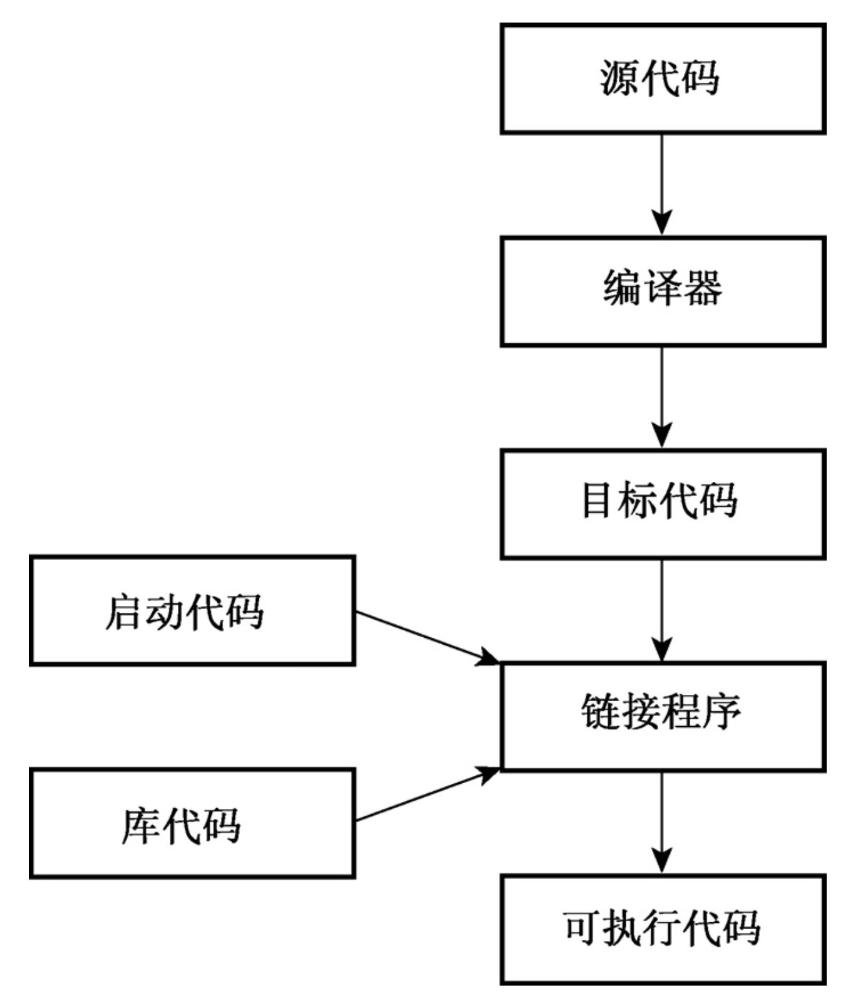

# C++ Primer Plus v6

>   书本即课后习题解答下载链接：链接: https://pan.baidu.com/s/1MiDc2DLKCue9HDVXG9xUiw?pwd=hsmm 提取码: hsmm

## 前言

《C++ Primer》和《C++ Primer Plus》都是公认的 C++ 语言的好书，虽然它们的名字相似，但实际上它们是不同的书。笔者虽然没有同时读过两者，但是在前期选择的时候也查过这两本书的区别。

|      |                       C++ Primer Plus                        |                          C++ Primer                          |
| :--: | :----------------------------------------------------------: | :----------------------------------------------------------: |
| 本质 |                           偏向实践                           |                        偏向持续性学习                        |
| 作者 | 作者 Prata, S. 是大学教授，是个学术性作家，写的书比较通俗易懂 | 两位作者都是拥有丰富的开发精力，是实践性作家，写的书比较深入 |
| 内容 |                    内容简单详细，层层递进                    |            内容偏向实战，可以对实操给出引导和建议            |

至于选择哪一本阅读，就看读者自己的安排了。笔者的建议是先阅读《C++ Primer Plus》，夯实基础的知识点，然后在实践中去读《C++ Primer》。

这篇笔记针对的是《C++ Primer Plus》第六版，第六版相对于第五版增加了一些 C++11 特性。

## 第一章 预备知识

>   本章介绍：(1) Bjarne Stroustrup 如何通过在 C 语言的基础上添加对面向对象编程的支持，来创造 C++ 编程语言；(2) 面向过程语言(如 C 语言)与面向对象语言(如 C++ )之间的区别；(3) 创建 C++ 程序的技巧和当前几种 C++ 编译器使用的方法。

C++ 是最重要的语言之一，它在 C 语言的基础上：

-   继承了 C 语言**高效、简洁、快速和可移植性**的传统。
-   为了应付日渐复杂的编程任务，增加了**面向对象**的特性。
-   提供了另一种全新的编程方法——**泛型编程**。

### 1.1 C++ 简介

C++融合了3种不同的编程方式：

-   C 语言代表的**过程性语言**
-   类代表的**面向对象语言**
-   C++ 模版支持的**范型编程**

### 1.2 C++ 简史

随着计算机性能的增长，更大更复杂的程序应运而生，这些程序在程序管理和维护方面带来了新的问题。在20世纪70年代， C 和 Pascal 这样的语言引领人们进入了**结构化编程**时代。除了提供结构化编程工具外， C 还能生成**简洁、快速运行**的程序，并提供了**处理硬件问题的能力**，如管理通信端口和磁盘驱动器。这些因素使C 语言成为 20 世纪 80 年代占统治地位的编程语言。与此同时，一种新的编程模式正在快速成长：面向对象编程 OOP 。 SmallTalk 和 C++ 语言具备这种功能。

#### 1.2.1 C 语言

操作系统是能够管理计算机资源、处理计算机与用户之间交互的一组程序。

传统上，程序员使用汇编语言完成设计要求。由于汇编语言时低级 (low-level) 语言，直接操作硬件，因此当这些程序需要移植到另一种计算机上时，必须使用不同的汇编语言重新编写程序。然而， UNIX 操作系统是为了在不同的计算机上工作而设计的，这需要一种高级语言。高级 (high-level) 语言致力于解决问题，而不针对特定的硬件。一种被称为**编译器**的特殊程序将高级语言翻译成特定计算机的内部语言，这相当于在程序和硬件隔开。 UNIX 设计者 Ritchie 希望有一种语言能将低级语言的效率、硬件访问能力和高级语言的通用性、可移植性融合在一起，于是他在旧语言的基础上开发了 C 语言。

#### 1.2.2 C 语言编程原理

一般来说，计算机语言要处理两个概念——**数据**和**算法**。

-   数据是程序使用和处理的信息
-   算法是程序使用的方法

为了理解 C++ 在 C 语言的基础上移植的新编程理念，我们需要先了解 C 语言的旧理念：

1.   C 语言是过程性语言。**过程性 (procedural) 语言强调的是编程的算法方面。**过程化编程首先要**确定计算机应采取的操作**，然后使用编程语言来实现这些操作。后来发展了结构化编程 (structured programming) 解决了“意大利面条式编程”问题，让程序更加有序。例如，结构化编程将分支（决定接下来应执行哪个指令）限制为一小组行为良好的结构。
2.   **自顶向下 (top-down) 的设计**。也叫分治法，将大任务不断分成小的任务，知道每个任务成为一个小型的、易编写的模块。 C 语言鼓励程序员开发程序单元（函数）来表示各个任务模块。

#### 1.2.3 面向对象编程 (OOP)

OOP 强调的是**数据**，其理念是设计与问题的本质特性相对应的数据格式。

在 C++ 中，**类**是一种规范，**对象**是根据这种规范构造的特定数据结构。可以理解为，类规定了事物的基本特征，对象则是一个个实体。通常，类规定了可使用哪些数据来表示对象以及可以对这些数据执行哪些操作，即**数据**和**方法**。

OOP 程序设计方法首先设计类，它们准确地表示了程序要处理的东西。从低级组织（如类）到高级组织（如程序）的处理过程叫做**自下向上** (bottom-up) 的编程。

OOP 完成了以下工作：

-   将数据和方法合并为类定义
-   创建**可重用**的代码
-   **信息隐藏**可以保护数据，使其免遭不适当的访问
-   **多态**能够为运算符和函数创建多个定义，通过编程上下文来确定使用哪个定义
-   **继承**能够使用旧类派生出新类

#### 1.2.4 C++ 和泛型编程

范型编程与 OOP 的目标相同，即使重用代码和抽象通用概念的技术更简单。不过两者是有区别的：

-   OOP 强调编程的数据方便，**常用于管理大型项目**
-   泛型编程强调的是独立于特定数据类型，**提供了执行常见任务的工具**

#### 1.2.5 C++ 的起源

与 C 语言一样， C++ 也是在**贝尔实验室**诞生的， **Bjarne Stroustrup** 于 20 世纪 80 年代在这里开发出了这种语言。他选择 C 作为基础是因为 C 语言简洁、适合系统编程、使用广泛且与 UNIX 操作系统联系紧密。 C++ 是 C 语言的超集，这意味着**任何有效的 C 程序都是有效的 C++ 程序**。它们之间有些细微的差异，但无足轻重。C++程序可以使用已有的 C 软件库（**库是编程模块的集合**，可以从程序中调用它们）。

C++ 融合了 OOP 、泛型编程和传统的过程性方法，这表明 C++ 强调的是实用价值，而不是意识形态方法，这也是该语言获得成功的原因之一。

-   C 部分则赋予了 C++ 语言紧密联系硬件的能力
-   OOP 部分赋予了 C++ 语言将问题所涉及的概念联系起来的能力
-   在C++获得一定程度的成功后，Stroustrup才添加了模板，这使得进行泛型编程成为可能。

### 1.3 可移植性和标准

**可移植性**指：如果在不修改代码的情况下，重新编译程序后，程序将运行良好，则该程序是可移植的。在可移植性方面有两个障碍：(1) 硬件特定的程序是不可移植的；(2) 不同系统的 C++ 实现并不一定兼容。

为了解决这一问题，联合组织 ANSI/ISO 1998 年制定出了一个**国际标准**，该标准常被称为C++98，它不仅描述了已有的 C++ 特性，还对该语言进行了扩展，添加了异常、运行阶段类型识别 (RTTI) 、模板和标准模板库(STL)。其后的 C++03 没有改变语言特性，因此我们使用 C++98 表示C++98/C++2003。 C++ 在不断地发展，于 2011 年 8 月推出了 C++11 。 C++11 新增了众多特性，同时消除了不一致性。

### **1.4** 程序创建的技巧



从 4.3 版起， g++ 要求编译源代码文件时使用标记 `-std=c++0x` ：

```shell
g++ -std=c++11 xxx.cpp
```

#### **1.4.1** 创建源代码文件

给源文件命名时，必须**使用正确的后缀**，将文件标识为 C++ 文件。后缀由一个句点和一个或多个字符组成，这些字符被称作扩展名。即文件命名格式： `文件名.后缀名` 。

源代码文件的扩展名：

|      **C++**实现      |  源代码文件的扩展名   |
| :-------------------: | :-------------------: |
|         UNIX          |     C、cc、cxx、c     |
|        GNU C++        | C、cc、cxx、cpp、c++  |
|     Digital Mars      |       cpp、cxx        |
|      Borland C++      |          cpp          |
|        Watcom         |          cpp          |
| Microsoft Visual C++  |     cpp、cxx、cc      |
| Freestyle CodeWarrior | cp、cpp、cc、cxx、c++ |

UNIX 区分大小写， `c` 对应 C 程序， `C` 对应 C++ 程序。

#### **1.4.2** 编译和链接

最开始实现 C++ 的时候，使用了一个 C++ 到 C 的编译器程序，叫做 cfront ，这种方法简化了向 C 的领域引入 C++ 的过程。随着C++的日渐普及，越来越多的实现转向创建 C++ 编译器，直接将 C++ 源代码生成目标代码。

##### 1. UNIX 编译和链接

`CC spiffy.C` --> 产生 `spiffy.o` --> 编译器自动将目标代码文件传递给系统链接程序，该程序将代码与库代码结合起来，生成一个可执行文件 `a.out` 

**如果只使用一个源文件，链接程序将自动删除目标代码文件**。

程序也可以包含多个文件，此时列出全部文件来编译程序： ` CC my.C precious.C` ，如果只修改了 `my.C` 文件，则可以单独编译修改的文件，并与其他文件链接起来： `CC my.C precious.o` 

编译时可能需要**显示地指定一些库**。

##### **2**. Linux 编译和链接

Linux 系统中最常用的编译器是 g++ ，这是来自 Free Software Foundation 的 GNU C++ 编译器。它的工作方式类似于 UNIX 编译器，**只是将 `CC` 变为 `g++` 命令**。

##### **3**. Windows 命令行编译器

**Cygwin 和 MinGW** 都包含编译器 GNU C++ ，且可免费下载。

##### 4. **Windows**编译器

当前，最流行是 **Microsoft Visual C++ 2010** 。

通常，必须为程序**创建一个项目**，并将组成程序的一个或多个文件添加到该项目中。必须确定的非常重要的一点是，需要创建的是什么类型的程序。本书的教程是通用的，应选择包含字样“控制台”、“字符模式”或“DOS可执行文件”等选项。编译器可能让您选择要生成调试版还是发布版。**调试版包含额外的代码**，这会增大程序、降低执行速度，但可提供详细的调试信息。

如果程序违反了语言规则，编译器将生成**错误消息**，指出存在问题的行。遗憾的是，如果不熟悉语言，将难以理解这些消息的含义。有时，真正的问题可能在标识行之前；有时，一个错误可能引发一连串的错误消息。一般的守则是：

>   改正错误时，应首先改正第一个错误。如果在标识为有错误的那一行上找不到错误，请查看前一行。
>
>   有时，编译器在不完全地构建程序后将出现混乱，它显示无法改正的、无意义的错误消息。在这种情况下，可以选择 Build All ，重新编译整个程序，以清除这些错误消息。遗憾的是，这种情况和那些更常见的情况（即错误消息只是看上去无意义，实际上有意义）很难区 分。

程序执行完毕后，有些 IDE 将关闭该窗口，而有些 IDE 不关闭。为查看输出，必须在程序的最后加上一些代码：

```cpp
cin.get();  // 让程序等待，直到按下了 Enter 键
cin.get();  // 可能存在残留的未处理字符，如最后一次输入的 Enter 键，使上一行失效
return 0;
```

##### **5**. Macintosh 上的 C++

Apple 随操作系统 Mac OS X 提供了开发框架 Xcode

## 第 2 章 开始学习 C++

>   本章介绍：(1) `main` 函数扮演的角色；(2) C++ 程序语句；(3) 程序输入输出；(4) 创建使用变量；(5) 函数。

C++ 对大小写敏感。